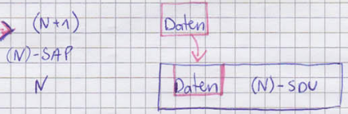
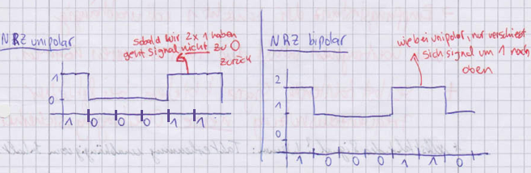
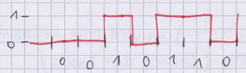
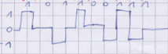

# Datenkommunikation

## IP-Adresse berechnen / Subnetting bei Subnetzen > 24

### 1. Klasse bestimmen

als Aufgabe haben wir 212.93.74.132/28

A => 0 - 127

B => 128 - 191

C => 192 - 223

Um die Klasse zu bestimmen, schauen wir uns das erste Oktett der IP an: also 212.
Wir schauen in die Tabelle, in welchem Bereich der Klasse die IP zutrifft. In diesem Fall auf die Klasse C. Man schreibt in der Klausur:

> ehemaliges Klasse-C-Netz => 212.93.74.0

Nachdem die Klasse ermittelt wurde, schriebt man noch die IP rein, aber:

- A: x.0.0.0
- B: x.x.0.0
- C: x.x.x.0

Wobei das x für die Zahlen der in der Klausur geforderten IP steht.

### 2. Subnetzmaske bestimmen

bei 4 Oktetten mit jeweils 8 Bit haben wir insgesamt 32 Bit zur Verfügung. Die ../28 in unserem Beispiel bedeutet, dass wir 28 "1er" in der Subnetzmaske haben. Umgekehrt sind 32-28=4 "0er" in der Maske.
Wir füllen also die IP mit 28 Einsern und 4 Nullen. Wobei die Nullen immer am Ende geschrieben werden!

+:------:+:------:+:------:+:------:+
|11111111|11111111|11111111|11110000|
+:------:+:------:+:------:+:------:+
| 255  . | 255  . | 255  . | 240		|
+:------:+:------:+:------:+:------:+

Wir schreiben in der Klausur folgendes hin:

__Subnetzmaske: 255.255.255.240__

### 3. mögliche Subetze

Formel: $2^{e} => e = 32 - 28 = 4$
also: $2^{4} = 16$	(alle Subnetze niederschreiben!)

212.94.74.0		(immer mit 0 anfangen und die Anzahl (in dem Fall 16) addieren)

+--------------+---------------+---------------+
| 212.94.74.16 | 212.94.74.112 | 212.94.74.208 |
+--------------+---------------+---------------+
| 212.94.74.32 | 212.94.74.128 | 212.94.74.224 |
+--------------+---------------+---------------+
| 212.94.74.48 | 212.94.74.144 | 212.94.74.240 |
+--------------+---------------+---------------+
| 212.94.74.64 | 212.94.74.160 |
+--------------+---------------+
| 212.94.74.80 | 212.94.74.176 |
+--------------+---------------+
| 212.94.74.96 | 212.94.74.192 |
+--------------+---------------+

### 4. Subnetzadresse herausfinden

Man schaut sich das letzte Oktett der IP-Adresse an, in dem Beispiel x.x.x.__132__
Diese Zahl vergleicht man in der "Tabelle" (aus Teilschritt 3.) und schaut, wo die Zahl 132 "reinpasst".

Die Zahl passt zwischen .128 und .144 also nimmt man den Untersten Wert und erhält die Subnetzadresse.

Vom obersten Wert (144) zieht man 1 ab und erhält die Broadcastadresse!

__Man schreibt also:__

>Subnetzadresse: 212.93.74.128

>Broadcast: 212.93.74.143

__Was Junker-Schilling wirklich lesen will:__

> 212.93.74.132 ist eine reguläre IP-Adresse im Subnetz 212.93.74.128. Die Broadcast Adresse ist 212.93.74.143.

### Sonderfall: Subnetze genau /24

man hat 256 mögliche Subnetze, also schreibt man: 

IP.IP.IP.0 -> __Subnetzadresse__!

jede beliebige IP ist da drin
 
IP.IP.IP.255 -> __Broadcast, nicht mit -1__!

\newpage

## IP-Berechnung bei Subnetzen < 24

__131.78.94.215 / 20__

ehemaliges Klasse-B-Netz => 131.78.0.0

+:------:+:------:+:------:+:------:+
|11111111|11111111|11110000|00000000|
+:------:+:------:+:------:+:------:+
| 255  . | 255  . | 240  . | 0			|
+:------:+:------:+:------:+:------:+

mögliche Subnetze: 

- entweder $32-20=12$ , also $2^{12} = 4096$
- oder: man zählt die oberen Nullen je Oktett

$2^{4} * 2^{8}=2^{12}=4096$

mögliche Hosts: 4096 - 2 = 4094 (__wegen Subnetz- und Broadcastadresse__, in Klausur schreiben, sonst Punktabzug)

- die Subnetzmaske lautet also 255.255.240.~~0~~
- man streicht die Null aus dem letzten Oktett und erhält somit 24 Bit (statt den üblichen 32 Bit). Mit diesen 24 Bits rechnet man weiter

=> $24-20=4$ => $2^{4} = 16$ (20 = Subnetz der IP)

__aber nicht wie üblich mit dem vierten Oktett sondern mit dem dritten.__

131.78.0.0

+------------+------------------------------------------+
|131.78.16.0 | die IP-Zahl des dritten 									|
+------------+------------------------------------------+
|131.78.32.0 | Oktetts ist die 94, diese								| 
+------------+------------------------------------------+
|131.78.48.0 | passt zwischen .80 und .96								| 
+------------+------------------------------------------+
|131.78.64.0 |  also ist die "Untergrenze" (80)					| 
+------------+------------------------------------------+
|131.78.80.0 | unsere Subnetzadresse										| 
+------------+------------------------------------------+
|131.78.96.0 | aber nur im dritten Oktett wird					| 
+------------+------------------------------------------+
|131.78.112.0| die Zahl reingeschrieben, die						| 
+------------+------------------------------------------+
|131.78.128.0| letzte Zahl (im 4.Oktett) wird						| 
+------------+------------------------------------------+
|131.78.144.0| mit einer 0 beschrieben									| 
+------------+------------------------------------------+
|131.78.160.0|																				  | 
+------------+------------------------------------------+
|131.78.176.0| __Subnetzadresse:__ 131.78.80.0					| 
+------------+------------------------------------------+
|131.78.192.0| Die Broadcastadresse ist die 						| 
+------------+------------------------------------------+
|131.78.208.0| "Obergrenze" (96) und von der 						| 
+------------+------------------------------------------+
|131.78.224.0| wird bekanntlich 1 abgezogen 						| 
+------------+------------------------------------------+
|131.78.240.0| und das 4. Oktett wird mit .255 gewertet:| 
+-------------------------------------------------------+

__Broadcast:__ 131.78.95.255

Merke: Wenn das Subnetz kleiner 24 ist, wird nur noch im dritten Oktett gearbeitet

Sobald das Subnetz < 16 ist, arbeitet man im 2. Oktett (siehe nächste Seiten)

## IP-Berechnung bei Subnetzen < 16

__135.240.252.7/14__

+:------:+:------:+:------:+:------:+
|11111111|11111100|00000000|00000000|
+:------:+:------:+:------:+:------:+
| 255  . | 252  . | 0    . | 0			|
+:------:+:------:+:------:+:------:+

Mögliche Subnetze: $2^{2} * 2^{8} * 2^{8} = 2^{18} = 262.144$

Mögliche Hosts: $262.144-2=262.142$

Man "streicht" die Nullen aus der Subnetzmaske -> 255.252.~~0~~.~~0~~ und erhält somit 16  mögliche Bits und rechnet mit diesen im 2. Oktett weiter

$16-14=2$ => $2^{2}=4$

+:---------:+:--------------------------------:+
|135.0.0.0  | man schaut sich das 2. Oktett		 |
+:---------:+:--------------------------------:+
|135.4.0.0  | der IP-Adresse an und vergleicht |
+:---------:+:--------------------------------:+
|135.8.0.0  | sie mit der Tabelle							 |
+:---------:+:--------------------------------:+
|135.12.0.0 | Untergrenze 240									 |
+:---------:+:--------------------------------:+
|..usw...   | Obergrenze $244-1=243$					 |
+:---------:+:--------------------------------:+
|135.236.0.0| 																 |
+:---------:+:--------------------------------:+
|135.240.0.0| 			|
+:---------:+:--------------------------------:+
|135.244.0.0| 		|
+:---------:+:--------------------------------:+

Subnetzadresse: 135.240.0.0

Broadcast: 135.243.255.255

Somit ist diese IP keine reguläre IP-Adresse sondern eine Subnetzadresse mit dem Broadcast 135.243.255.255, da das zweite Oktett in der IP genau die Zahl ist, die in der Tabelle die Untergrenze darstellt.

117.75.100.255/22 aus dem WS16/17 ist ebenfalls keine reguläre Adresse, sondern eine Subnetzadresse. 

__Bei Subnetzen kleiner 8 wird die gleiche Rechnung aufgestellt nur mit dem ersten Oktett.__

\newpage

## Aufgabe aus WS16/17

Betrachten sie folgende Situation: 

\

R ist als Router zu anderen Netzen konfiguriert.

Beschreiben und erläutern Sie ausführlich den Protokollablauf, wenn in kurzem zeitlichen Abstand auf den Rechnern X und Y das Kommando

			ping 156.156.20.190

ausgeführt wird.

__Antwort laut Fertig:__

- X beginnt (sendet Pmg (?) an Router)
- Y kurz danach
- Kommunikation zwischen X und R stoppt
- Kurz danach läuft Kommunikation weiter während Kommunikation zu Y und R stoppt
- ARP-Request zwischen X & Router
- Echo-Request & Echo-Reply
- ARP-Request zwischen Y & Router
	- R merkt sich nun IP-Adressenzuordnung zu Y 
- alle Echo-Replys zu Y
	- egal ob von X oder Y angefordert
- neue Adressauflösung von Router eingeleitet
- X wird wieder zugeteilt (der als letztes angekommen)
- alle Echo-Replys gehen an X

\

+:-------------:+:----------:+:----------------:+:----------:+
| Destination   | Gateway    | Mask             | Interface|
+:--------------+:-----------+:-----------------+:-----------+
| 142.75.40.192 | Router 4 * | 255.255.255.192  | eth0|
+:--------------+:-----------+:-----------------+:-----------+
| 142.75.10.128 | Router 1   |  255.255.255.192 | eth2|
+:--------------+:-----------+:-----------------+:-----------+
| 142.75.20.64  | Router  1  |  255.255.255.192 | eth2|
+:--------------+:-----------+:-----------------+:-----------+
| 142.75.30.64  | Router  5  |   255.255.255.224| eth1 |
+:--------------+:-----------+:-----------------+:-----------+
| 142.75.50.32  | Router  5  |  255.255.255.224 | eth1 |
+:--------------+:-----------+:-----------------+:-----------+

__Destination:__ hier wird die Zieladresse eingetragen ohne das Subnetz! Also wenn man von Router 4 auf Router 1 möchte, dann schreibt man die IP-Adresse von Router 1 rein und zwar ohne Subnetz ../xx

__Gateway:__ gibt an, auf welchem Router man sich aktuell befindet

__Maske:__ man schreibt die Subnetzmaske des aktuellen Routers aus der IP-Wolke rein. Also man "rechnet" das Subnetz in eine Maske um.

+--------------------------+
| __Merke:__|
+--------------------------+
|__/24 =__ 255.255.255.__0__|
+--------------------------+
|__/25 =__ 255.255.255.__128__|
+--------------------------+
|__/26 =__ 255.255.255.__192__|
+--------------------------+
|__/27 =__ 255.255.255.__224__|
+--------------------------+
|__/28 =__ 255.255.255.__240__|
+--------------------------+
|__/29 =__ 255.255.255.__248__|
+--------------------------+
|__/30 =__ 255.255.255.__252__|
+--------------------------+
|__/31 =__ 255.255.255.__254__|
+--------------------------+

1. jede IP-Wolke entspricht einer Zeile in der Klausur > in diesem Fall habe ich 5 Zeilen auszufüllen

2. wenn in der Klausur steht: "... geben Sie den Inhalt der Tabelle für Router 4 an." dann beginnt man mit diesem Roter und geht immer von diesem Router aus auf die anderen Router

3. man entscheidet sich immer für den kostengünstigsten Weg. Wenn man in diesem Beispiel von Router 4 auf Router 2 möchte, dann geht man durch Router 1 da bei diesem Weg die Kosten am geringsten sind!

4. Ganz am Anfang der Tabelle, wenn man wie in diesem Beispiel mit Router 4 anfängt, dann ist in der ersten Zeile das Interface (fast) immer eth0. Da wir von Router 4 immer ausgehen (um zu den anderen Routern zu gelangen), gibt es in diesem Fall nur zwei Interfaces, die man berücksichtigen muss: eth1 und eth2. Geht man nach "rechts", so ist eth1 zuständig und geht man nach "oben" ist es eth2. Selbst wenn man Router überspringt, konzentriert man sich immer nur auf die eth's vom in der Klausur geforderten Router (in diesem Fall Router 4)!

\

5. Wenn Router übersprungen werden, also z.B. wenn wir von Router 4 zu Router 3 wollen, dann müssen wir erst durch Router 5 gehen. Im Gateway schreiben wir Router 5 hin, obwohl wir zu Router 3 wollen. Das Gateway beschreibt, wer uns auf dem Weg zu unserem Zielrouter (Destination) so alles begegnet. Oder wenn wir von Router 4 zu Router 2 wollen, dann müssen wir durch Router 1 gehen. Router 1 wird in diesem Fall in der Tabelle bei Gateway eingetragen, obwohl wir zu Router 2 wollen. Diese Methode wird nur angewandt, wenn wir Router überspringen.

\newpage

__Sonderfall WS07/08__

Dort muss man von Router 2 aus gehen. Es müssen 5 Zeilen ausgefüllt sein, also 3 IP-Wolken und 2 IP's, die auf den Ethernets stehen. In diesem Fall gehören die "losen" IP's also nicht die IP's in den Wolken, zu Router 2. Deswegen gibt man im Gateway Router 2 an, wenn man zu den losen IP's will.

\

Vom Client-Rechner 197.214.19.175 wird erstmals der Aufruf http://www.shop.domainx.com abgesetzt. Erläutern Sie die einzelnen Übertragungsvorgänge, die als Folge dieses Aufrufs im dargestellten Netzbereich stattfinden. In der korrekten zeitlichen Reihenfolge.

Hinweise:

- Sie brauchen keine Fehlerfälle berücksichtigen
- Sie brauchen nicht jede einzelne PDU zu beschreiben bzw. zu analysieren
- Es genügt wenn Sie die Bedeutung bzw. Auswirkung einer Übertragung erläutern

### Wolkenaufgabe

Man schaut sich zuerst an, ob sich der DNS-Server im eigenen Subnetz befindet:

- wenn ja: Client löst IP des DNS-Servers direkt auf
- wenn nein: Auflösung erfolgt durch den Router

1. Client macht mittels ARP-Request eine Adressauflösung auf den DNS-Server im eigenen Netz
(wenn nicht im eigenen: Auflösung über Router)
	- macht man deswegen, weil man sowohl IP, als auch die MAC-Adresse des DNS-Servers braucht
	- Client erhält Antwort vom DNS-Server (ARP-Reply) 
		- Mac-Adresse des DNS-Servers ist nun bekannt

2. Client möchte IP-Adresse des Webservers im Internet -> DNS-Request an DNS-Server und Client erhält vom DNS-Server im eigenen Netz die IP-Adresse vom Webserver(__=iterative Namensauflösung__)
	- IP-Adresse des Webservers wurde ermittelt und es ist bekannt, dass IP vom Webserver nicht im eigenen Subnetz liegt
		- d.h. die komplette Kommunikation zwischen Client und Webserver läuft über den Router
(falls IP von Webserver im eigenen Subnetz -> direkte Verbindung ohne Router)
	- falls IP vom Webserver im eigenen Subnetz -> direkte Verbindung ohne Router

3. IP-Adresse des Routers wird in eine MAC-Adresse aufgelöst (mit ARP-Request)

4. Wenn Antwort vorhanden (ARP-Reply vom Router) -> TCP-Aufbau über den Router auf Webserver kann eingeleitet werden
	-> es wird ein Three-Way-Handshake ausgeführt

5. HTTP-Request wird vom Browser verschickt und es wird eine Antwort vom Webserver erwartet

Es kann sein, dass eine Aufgabe kommt, in der der DNS-Server __nicht__ im eigenen Subnetz ist:

1. ARP-Request auf den Router
	-  ARP-Reply vom Router > MAC-Adresse vom Router jetzt bekannt
2. DNS-Request über Router an DNS-Server
	- DNS-Request vom DNS-Server
3. DNS-Request von DNS-Sever aus an den Webserver
	- DNS-Request vom DNS-Server an Client =  iterative Namensauflösung
	- es ist nun bekannt, dass Webserver nicht im eigenen Subnetz liegt
4. TCP-Verbindungsaufbau über Router an Webserver kann eingeleitet werden
	- 3-Way-Handshake wird ausgeführt
5. HTTP-Request vom Browser wird verschickt und man erwartet eine Antwort vom Webserver

## Klassifikation von Rechnernetzen

__erfolgt durch 3 Kriterien:__

1. technische Merkmale der Kopplung
	- WAN: Wide Area Network -> für große Entfernungen
	- LAN: Local Area Network -> alle Rechner im abgeschlossenen Gebiet
	- MAN: Metropolitan Area Network -> Hochgeschwindigkeitsübertragung in einer Region
	- GAN: Global Area Network -> DÜ über Satelliten -> Hohe Übertragungsgeschwindigkeit, aber viele Fehler
	- PBX: Private Branch Exchange -> DÜ über Nebenstellenanlage

2. Art der Verbindungsführung
	- Wie wird die Verbindung zur Verfügung gestellt?
		- feste Verbindungen zwischen Endpunkten
			- nur 2 Kommunikationspartner, kein Dritter kann diese Verbindung nutzen, ist jederzeit verfügbar
		- vermittelte Verbindungen (Wegewahl)
			- Durchschalte - / Teilstreckenvermittlung
		- Verteilnetze (Funk und Fernsehen, WLAN) alle die eine Antenne zwischen dieser Verbindung richten, hören alles mit

3. Technische Freizügigkeit
	- Herstellergebundenes Netz -> alle angeschlossenen Geräte gehören zu einer Herstellerfamilie
	- Herstellergebundenes Netz (offen) -> jedes Endgerät soll angeschlossen werden und Verbindung mit allen Stationen im Netz aufnehmen können

## OSI-Architekturmodell (Open System Interconnection)
- man fasst alle Funktionen, die zur Rechnerkommunikation notwendig sind, zu Teilbereichen zusammen
- die Teilbereiche müssen zusammenarbeiten

### Hierarchie: 

__verschiedene Instanzen der Schichten:__

1. Hardware 
2. Betriebssystemkern
3. Betriebssystemerweiterungen
4. Laufzeit eines Compilers

*    *    *    *    *

5. Anwendungsprogramm
6. Menuoberfläche
7. Benutzer

- 1.-3. Schicht: Netzwerkorientierte Schichten
- 4. Schicht: Transportschicht
- 5.-7. Schicht: anwendungsorientierte "sichtbare" Schichten (Browser, Skype etc.)

__wichtig:__
In jedem System gibt es eine vertikale Kommunikation benachbarter Funktionsbereiche.

{height=150px}\

Übertragene Information enthält:

- Daten zwischen Anwendung und Benutzer
- Steuerinformationen zur Verständigung der beiden Systemen (das nennt man horizontale Kommunikation)

{height=150px}\

Eine horizontale Kommunikation kann nicht "kreuz und quer" gehen sondern nur zur benachbarten Instanz "gleicher Güte".

## Definitionen 
### (N)-Schicht / (N)-layer
- n-te Stufe der Architektur offener Kommunikationssysteme
- eine Schicht wird inhaltlich durch eine Menge von Funktionen / Dienstleistungsangeboten gegenüber der höheren Schicht definiert

### (N)-Funktion
- definierter Teil innerhalb des Aufgabenspektrums -> festgelegt für (N)-Schicht
- etwas, was er automatisch macht

### (N)-Dienstleistung / (N)-service
- eine Arbeit, die von (N)-Schicht erbracht wird
- und der (N+1)- Schicht zur Nutzung gestellt wird

### (N)-Instanz / (N)-entity
- aktives Element im OSI-System
- repräsentiert (N)-Schicht
	- wenn wir 3 Systeme haben und wir schauen uns die 5te Schicht des 2ten Systems an, ist das die Instanz und die N-Schicht ist der allgemeine Ausdruck

### (N)-Dienstzugangspunkt / (N)-SAP (service access point)
- Schnittstelle zwischen (N)- und (N+1)-Instanz
- am (N)-SAP erfolgt der Zugriff auf ein (N)-Service
- vertikale Kommunikation in beide Richtungen

\

### Dienstprimitive

Beschreibung der Kommunikation am (N)-SAP

- **REQUEST** (Anforderung eines Dienstes)
	- Dienstanforderung durch (N+1)-Instanz
	- geht von oben nach unten
	- auf ein REQUEST folgt ein CONFIRMATION
- **CONFIRMATION** (Bestätigung, dass ein Dienst angefordert wurde
	- Antwort auf REQUEST
	- (also: Bestätigung der Bearbeitung einer Dienstleistung durch (N)-Instanz)
- **INDICATION** (Anzeige, dass ein Dienst angefordert wurde)
	- geht von unten nach oben
	- auf ein INDICATION folgt ein RESPONSE
- **RESPONSE** (Reaktion des Dienstes auf eine Dienstanzeige)
	- Antwort auf INDICATION
	- (also: Bestätigung der Annahme einer erbrachten Dienstleistung durch (N+1)-Instanz)

__Notation:__

(N)-Name der Dienstleistung _ Name des Dprimitivs z.B.

+ (N)-DATA\_REQUEST
+ (N)-CONNECT\_CONFIRMATION
+ (N)-CONNECT\_INDICATION

### Logische Kommunikation
- Dialog zwischen gleichgestellten Instanzen
- kann kontrolliert (geregelt, Fehlerkontrolle) oder unkontrolliert (ungeregelt, keine Fehlerkontrolle) erfolgen

\

### Partnerinstanzen
- Instanzen der selben Schicht in verschiedenen OSI Systemen heißen gleichgestellte Instanzen

### (N)-Protokoll
- Gesamtheit aller Regeln für Kommunikation zwischen gleichgestellten Instanzen
- Regeln:
	- Syntax & Semantik der Sprache
	- Festlegung von Parametern, die Auswirkung auf beide Instanzen haben
	- Keine Implementierungsvorgaben

### logische Verbindung
- Absprache zwischen gleichgestellten Instanzen über eine kontrollierte logische Kommunikation
- Basis für den Austausch von Steuerungsinformationen der (N)-Instanzen
- Abbild des physikalischen Übertragungswegs für (N+1)-Schicht

> Also: Partnerinstanz (Instanz auf der anderen Seite) muss wissen, dass das Paket zu dieser logischen Verbindung gehört

{height=150px}\

## Dateneinheiten

### Dateneinheit / Service Data Unit (SDU)
- wird durch (N)-Instanz bereitgestellt
- für jede Dienstleistung der (N)-Schicht, bei der Daten über (N)-SAP übertragen werden
- Daten der (N+1)-Instanz müssen vollständig in SDU passen
- Daten dürfen kleiner als SDU sein

{height=150px}\

### Schnittstellendateneinheit / Interface Data Unit (IDU)
- Übergabe von Daten an (N)-SAP in 1...n IDUs
- Container zur DÜ zw. 2 benachbarten Instanzen

{height=150px}\

### Protokolldateneinheit / Protocol Data Unit (PDU)
- besteht aus PCI und SDU
- dient der Kommunikation zweier gleichgestellter Instanzen (horizontale Kommunikation)

### Protokollsteuerinformation / Protocol Control Information (PCI)
- Steuerinformation der PDU, Träger der logischen Kommunikation
- sagt der Partnerinstanz, wie Daten interpretiert werden sollen

## Referenzmodell (Schichten)

{height=340px}\

__Netzwerkorientierte Schichten (1-3)__
- alle Funktionen, die die Übertragung der Informationen im Netz betreffen

__Anwendungsorientierte Schichten (5-7)__
- "sehen" nichts von der Übertragung der unteren Schichten, da die Sicht vollständig von der Transportschicht verdeckt wird

__Schichten:__

1. Bitübertragungsschicht (Physical Layer)
	- serielle Übertragung binärer Informationen auf einem beliebigen Übertragungsweg

2. Sicherungsschicht (Link Layer)
	- Fehlererkennung -> ggf. Fehlerbehandlung
	- Steuerung des Netzzugriffs

3. Netzwerkschicht (Network Layer)
	- abschnittsweise gesicherte Übertragung
	- Wegewahl

4. Transportschicht (Transport Layer)
	- effiziente Nutzung der Übertragung
	- Ende-zu-Ende-Kontrolle
	- Aufgabe: anwendugnsorientierte Schichten (5-7) sollen von der Verwaltung & Steuerung befreit werden

5. Kommunikationssteuerungsschicht (Session Layer)
	- Synchronisation der realen Kommunikation
	- Wiederanlauf

6. Datendarstellungsschicht (Presentation Layer)
	- Codierung der Daten
	- Beschreibung der Datenstrukturen

7. Anwendungsschicht (Application Layer)
	- Grundfunktionen für den Anschluss einer Anwendung an das Verbundsystem

## Definitionen

### 1:1 - Zuordnung
- Genau __eine__ (N)-SDU wird in genau __eine__ (N)-PDU umgearbeitet / übertragen
- wird von allen Protokollen aller Schichten unterstützt

{height=120px}\

### Segmentieren / Reassembilieren
- am häufigsten implementierte Zuordnungsverfahren
- Aufteilung einer (großen) (N)-SDU in mehrere (N)-PDUs
- PCI kennzeichnet, dass und wie reassembliert werden muss
- ermöglicht Anpassung an Übertragungssystem ohne die höhere Schicht zu "belästigen"
- eine große (N)-SDU wird auf mehrere (N)-PDUs aufgeteilt
- jede PDU erhält dabei eine PCI, indem die Information zum Reassemblieren hinterlegt wird

\

Reassemblieren ist empfangsseitig erforderlich, um die gleiche SDU zu erzeugen.

### Blocken / Entblocken
- Gegenstück zum Segmentieren / Reassemblieren
- mehrere (kleine) SDUs in einer PDU zusammenfassen
	- zu jeder SDU wird auch eine PCI in der PDU hinterlegt
- Blocken und Position der SDU-Inhalte wird in PCI angezeigt
- Infos zum Entblocken befinden sich in den PCIs
- Nutzbarkeit eingeschränkt:
	- Instanz muss erkennen, ob und vor allem wie schnell SDUs übergeben werden
- Bei dieser Methode kann es durch das Warten bis die PDU gefüllt ist, zu Wartezuständen im Programm kommen

\

### Verketten / Trennen
- ermöglicht __Blocken__ direkt am (N)-SAP
- ermöglicht Datenübertragungen verschiedener Auftragsgeber zusammenzufassen
- nur theoretische Bedeutung
- SAP fasst die Instanz mehrere PDU's zu einer SDU zusammen
- Kennzeichnung zur Nutzung wird in jeweiligen PDU's mitgeliefert

\

## Wartezustände 
### Synchrones Warten
- verbietet Instanz weiter Aktionen für diese Verbindung auszuführen

### Asynchrones Warten
- Schreibt die Kontrolle des Eintreffens eines Ereignisses innerhalb einer Zeitspanne vor

*Synchrones und asynchrones Warten aufgrund eigener Initiative!*

### Zentrale Wartezustände 
- bei Kommunikationsphase muss eine (N)-Instanz immer auf (N)\_DATA\_REQUEST oder (N-1)-DATA\_INDICATION warten
- nach Initialisierung wird auf Aufträge der benachbarten Instanzen gewartet z.B.:
	- (N)-CONNECT\_REQUEST
	- (N-1)-DATA\_INDICATION
- zentrale Wartezeiten sind parallel zu beliebigen anderen Arbeiten zu bedienen

### Phasen verbindungsorientierter Kommunikation

1. Verbindungsaufbau
2. Kommunikation
3. Verbindungsabbau

{height=320px}\

{height=320px}\

### Bestätigter Dienst
- auf einen __Request__ kommt immer eine __Confirmation__
- auf eine __Indication__ kommt immer eine __Response__

### Synchron bestätigter Dienst
- vor der Confirmation im eigenen System muss das Indication & Response im Partnersystem erfolgen
- Zeitliche Abstimmung nötig
- signalisiert den erfolgreichen Abschluss des Service

### Asynchron bestätigter Dienst
- Keine zeitliche Abstimmung nötig
- Confirmation kann irgendwann erfolgen
- Confirmation sagt nur, dass (N)-Instanz sich um Diensterfüllung kümmert

## Verbindungsaufbau 
- Schicht 5 möchte Verbindung aufbauen -> 5 = (N+1)
- Schicht 4 muss beschrieben werden => 4 = (N)

__lokales System__

1. (N)-CONNECT\_REQUEST -> (N+1) wartet synchron
2. (N-1)-CONNECT\_REQUEST -> (N) wartet synchron
3. (N-1)-CONNECT\_CONFIRMATION -> Aufheben der Wartezeit von (N)
	- (N) bereitet (N)-PDU zum Verbindungsaufbau auf
4. (N-1)-DATA\_REQUEST
	- ggf. wird (N)-PDU in mehrern IDUs übergeben
	- (N) wartet asynchron auf Bestätigung
	- (N) wartet synchron auf Antwort
	- (N-1) bereitet Datenübertragung vor
5. (N-1)-DATA\_CONFIRMATION
	- asynchrones Warten endet von (N)
__Partnersystem__ (entferntes System)
6. (N-1)-DATA\_INDICATION -> (N-1) wartet asynchron
7. (N-1)-DATA\_RESPONSE
	- (N) interpretiert PDU und prüft, ob Verbindungsaufbau möglich

*     *    *    *    *
- beim symmetrischen Verfahren: (darf nichts Chef fragen)
	- (N)-CONNECT\_INDICATION -> (N) wartet synchron
	- (N)-CONNECT\_RESPONSE -> falls logische Verbindung nutzbar 
	- muss nur dann reingeschrieben werden, wenn danach in der Klausur explizit gefragt wird

*     *    *    *    *

(N) bereitet Antwort-PDU auf
8. (N-1)-DATA\_REQUEST
	- (N) wartet asynchron auf Bestätigung und wartet synchron auf DÜ
	- (N-1) bereitet Datenübertragung vor
9. (N-1)-DATA\_CONFIRMATION
	- (N) geht in den zentralen Wartezustand über für die Kommunikationsphase
	- exkurs: aus diesem wird sie durch (N)-DATA\_REQUEST oder (N-1)-DATA\_INDICATION geholt

__lokales System__

10. (N-1)-DATA\_INDICATION -> (N-1) wartet asynchron
	- (N) übernimmt Informationen ggf. in mehrern IDUs
11. (N-1)-DATA\_RESPONSE 
	- (N) interpretiert Antwort-PDU -> Aufheben des Wartezustands
12. (N)-CONNECT\_CONFIRMATION -> synchrones Warten von (N+1) endet
	- (N) geht in zentralen Wartezustand über -> Beginn der Kommunikationsphase

{height=380px}\

## Verbindungsabbau

1. (N)-DISCONNECT\_REQUEST -> wartet asynchron -> (N+1)
	- Aufbau (N)-PDU zum Verbindungsabbau
2. (N-1)-DATA\_REQUEST
	- wartet synchron auf Bestätigung der Partnerinstanz
	- (N) wartet asynchron auf (N-1)-DATA\_CONFIRMATION
3. (N-1)-DATA\_CONFIRMATION -> asynchrones Warten endet von (N)

__Partnersystem__

4. (N-1)-DATA\_INDICATION
5. (N-1)-DATA\_RESPONSE
	- Prüfung der (N)-PDU
6. (N)-DISCONNECT\_INDICATION
	- (N+1) prüft Verbindungsabbau
7. (N)-DISCONNECT\_RESPONSE
	- Aufbau der Antwort (N)-PDU
8. (N-1)-DATA\_REQUEST
9. (N-1)-DATA\_CONFIRMATION

__lokales System__

10. (N-1)-DATA\_INDICATION -> wartet asynchron
11. (N-1)-DATA\_RESPONSE
	- Prüfung der (N)-PDU -> synchrones Warten endet
		- logische Verbindung existiert nicht mehr
12. (N)-DISCONNECT\_CONFIRMATION -> asynchrones Warten endet
	- (N-1)-DISCONNECT\_REQUEST -> nächste Schicht

{height=320px}\

### bestätigter Dienst
- die Anforderung einer Dienstleistung im initiierenden System führt zur INDICATION im reagierenden System. Bei einem bestätigten Dienst folgt darauf immer ein Response im reagierenden System

### synchron bestätigter Dienst
- erfordert eine zeitliche und inhaltliche Koordination zwischen der vertikalen und der horizontalen Kommunikation

### asynchron bestätigter Dienst
- erfordert keine Koordination in der horizontalen Kommunikation

## Signale

__Definition__

Physikalische Darstellungsform von Information bei einer Übertragung. (Meist wird der zeitliche Verlauf der Amplitude einer elektro-magnetischen Welle dargestellt)

### Signalklassen

- Klasse 1: analog -> Kontinuierliche Zeit- & Signalachse
	Charakteristik / Einhzelschwingung durch: 
	+ zeitliche Amplitude
	+ Frequenz
	+ Phasenlage (ZAPF)

- Klasse 4: digital -> diskrete Zeit- & Signalachse
	Charakteristik: 
	+ Takt (oder auch Schrittdauer genannt)
	+ Wertigkeit (=AZ der diskreten Amplitudenstufen)
	+ Schrittgeschwindigkeit $V_{S}$ => Schritte pro Zeit => 1 Baud
	+ Übertragungsgeschwindigkeit $V_{0}$ => Bit pro Sekunde = 1 Bit/s

n-wertiges, digitales Signal: $V_{0} = ld(n)*v_{s}$

### Sollzeitpunkte $t_{s}$
- diskrete Werte der Zeitachse
- Signalpegel kann sich ändern (am Sollzeitpunkt)

### Abtastpunkte $t_{A}$
- Zeitpunkte, in denen der Empfänger das Signal abtastet

### Kennzeitpunkt $t_{K}$
- bei realem Signal kann sich Amplitude ändern
 

## Störung der Signalübertragung

- Dämpfung, elektromagnetische Wechselwirkung, Nebensprechen
- Signalübertragungen unterliegen Störeinflüssen, die durch Zusatzeinrichtungen teilweise kompensiert werden können
- Art und Auswirkung dieser Störeinflüsse sind abhängig vom Übertragungsweg und Signalform

### Dämpfung (Absenken der Amplitude)

1. Metallische Übertragungswege
	- erfolgt durch Stromfluss
	- ohmscher Widerstand als dämpfende Wirkung
	- Wechselstrom wird gestört durch induktive und Kapazitive Widerstände
	- Resultat: führt zu einer frequenzabhängigen Dämpfung

2. Lichtwellenleiter (LWL)
	- Lichtwelle wird durch Unreinheiten im Glas gestört (nennt man Streuung)
	- Anregung von Atomkernen => Energieentzug

3. Funkstrecken
	- durch Änderung in der Atmosphärenzusammensetzung
$$\frac{P_{Empfangsleistung}}{P_{Sendeleistung}} = (\frac{\lambda}{4 * \Pi * d})^{2}$$
$$=> also: \frac{Empfangslseistung}{Sendeleistung}$$
	- schneller Schwund:
		- Ursache: durch Mehrweg-Ausbreitung 
		- infolge von: Reflexion => es kommt zu einer Interferenz gleicher Wellen
		- Gangunterschied halber Wellenlänge => es tritt eine Auslöschung auf
		- sogenannte Bündelfehler treten auf
	- langsamer Schwund:
		- Abschattungen (Funkloch) verhindern Empfang
		- Effekt tritt nicht schlagartig auf

__Abhilfe zu Dämpfungen:__ rechtzeitige Signalverstärkung

### Elektromagnetische Wechselwirkung
- Störung durch äußere elektromagnetische Einflüsse 
	- z.B. Gewitter

__Abhilfe:__
- Lichtwellenleiter einsetzen
- Abschirmungen

### Nebensprechen
- Spezialfall der elektromagnetischen Störung
- verursacht durch Kabelbündelung
	- gegenseitige Beeinflussung durch nach außen wirkendes, elektromagnetisches Wechselfeld
- Auswirkung: Dämpfung und/oder Verzerrung
	- auf Übertragungswert kann eine Verschiebung zwischen Kenn- & Sollzeitpunkten eintreten

### Kanalcodierung
- Umsetzung eines Bits in ein auf dem Übertragungsweg nutzbares Signal
- ist abhängig von Qualitätsanforderungen
- also: Anpassung des Signals an Übertragungsweg

### Exkurs: Aufgabe der Schicht 1
- möglichst fehlerfreie Übertragung der Signale auf einem störanfälligen Fernmeldeweg zu gewährleisten

### Quellcodierung
- Übersetzung einer Nachricht in eine PDU

### Verschlüsselung
- Quellcodierung erfolgt mit protokollunabhängigem Zusatzwissen
- Zusatzwissen ist nur den beiden beteiligten Partnerinstanzen bekannt
- wird in Schichten 2-7 durchgeführt (Quellcodierung)

### Basisbandübertragung
- gesamtes Frequenzspektrum wird für die Übertragung genutzt

### Bandübertragung 

__eigentlich Trägersignalverfahren__:

- Sendesignal muss an Übertragungsweg angepasst werden
- zeitgleiche Nutzung mehrere Datenübertragungen
- Jede Datenübertragung bekommt bestimmte Frequenz zugewiesen

### Exkurs: Anforderungen an Signalformen
- Sicherheit bei Takt-Erkennung
- geringer Gleichstromanteil
- einfache technische Realisierung
- genügend große Bandbreite

### Signalvorlauf
- am Anfang der Übertragung wird eine bekannt Bitfolge gesendet (Lernen des Takts)

### Selbsttaktendes Signal
- ermöglicht Erkennung des Taktes, unabhängig vom übertragenden Signalwert
- z.B. Pegelwechsel in jedem Takt
- bipolares RZ-Signal, AMI, Manchester

## Selbsttaktende Signale

In Klausur sind meist Zeichnungen gegeben, die man zuordnen muss (selbsttaktend oder nicht).

__Achtung! Nicht alle Signale sind selbsttaktend!__

### NRZ-Signale (No-Return-to-Zero)
- nicht selbsttaktend
- Signal != 0 -> gesamten Takt lang != 0
- bipolar :
	- leichtere Abtastung
	- hohe Gleichstromteile

\

### NRZ unipolar
- wenn Strom fließt = 1
- wenn kein Strom fließt = 0

NRZ = no return to zero => der Pegel kehrt nicht nach jeder Zeiteinheit auf den Nullwert zurück.

\

### NRZ bipolar
- einziger Unterschied zu NRZ unipolar: bei gesendeter "0" entsteht eine negative Spannung

\

### Funktion des selbsttaktenden Signals
- Empfangsinstanz der Schicht 1 soll unabhängig von übertragenden Inhalt den Takt erkennen können
- selbsttaktende Signale bieten bei gleicher Frequenzausnutzung _keine_ Übertragungssicherheit
- selbsttaktendes Signal? Wenn: Takterkennung unabhängig vom Inhalt ist

### RZ-Signale (Return-to-Zero)
- Signal != 0 -> Rückführung zu 0 während Takt
- bipolare RZ-Signale sind:
	- selbsttaktend
	- reduzieren Gelichstromanteil
- verbrauchen doppelte Bandbreite
- technisch aufwändiger
- bipolare RZ-Signale mit doppelter Schrittgeschwindigkeit möglich

\

### AMI (Alternate Mark Inverted)
- 1-Werte und 0-Werte werden _abwechselnd_ durch zwei unterschiedliche Pegel dargestellt
- Vorteil: dadurch wird Fehlererkennung verbessert
- Nachteile:
	- Reduktion der Übertragungsgeschwindigkeit um Faktor 2
	- Reduktion des Gleichstromanteils
- wie bei unipolar NRZ, nur dass wir bei der 1 ins "negative und bei der nächsten 1 wieder ins positive 1

\

### Manchester-Signal
- für Hochgeschwindigkeitsübertragungen in lokalen Netzen
- schnell reagierende & sichere Abtastverfahren nötig
- selbsttaktend
- Wert wird durch Richtung des Pegelwechsels in der Mitte der Phase bestimmt
	- Phasencodierung
- verbraucht doppelte Bandbreite
- hat geringen Gleichstromanteil

\

### Pulscodemodulation (relevant?)
- Modulation = Anpassung an den Übertragungsweg
- Sprachsignal (analog) -> digitale Übertragung (ISDN)
- hohe Frequenzen werden herausgefiltert (aus analogem Signal)
- Signal nach bestimmten Raster abtasten
	- pulsförmiges Signal
	- zeitdiskret
- Quantisierung (Rundung) auf 256 mögliche Werte -> wertdiskret
- Codierung in 8-Bit-Wert

### Trägersignalverfahren
- unterschiedliche Frequenzbänder für verschiedene Übertragungen die zeitgleich denselben Übertragungsweg benutzen
- sorgt dafür, dass Signal in seinem Frequenzbereich bleibt
- analoges oder digitales Signal an den verfügbaren Übertragungsweg (digital oder analog) anpassen -> __Modulation__
- Einpassen in Frequenzband mithilfe eines Trägers
- die charakteristischen Größen des Trägers (Amplitude, Frequenz, Phasenlage) werden so verändert, dass:
	- modifiziertes Signal im Frequenzband liegt
	- Modifikation ist eindeutig umkehrbar
- solange erfüllt -> Datenübertragung des modifizierten Trägersignal möglich
- Emfänger kann durch umgekehrte Modifikation ursprüngliches Signal zurückgewinnen
- also TSV bedeutet: Anpassung des Sendesignals an Übertragungsweg
- Anpassung nennt man Modulation und Demodulation
	- auf analogen und digitalen Träger anwendbar

### Träger
- ein Signal, das in das Frequenzband passt
	- z.B. einfache Sinusschwingung
	- besitzt charakteristische Größen (siehe oben)
	- A, F, P

### Multiplexverfahren
- mehrere Signale werden zusammengefasst (gebündelt) und zeitgleiche über ein Medium (Kabel, Funk) übertragen
- Bündelung erfolgt, nachdem Daten auf Trägersignal moduliert wurden
- Empfänger entbündelt diese => Demodulation
- Ziel: Übertragungswege sollen kostengünstig / effizient genutzt werden

### Frequenzmultiplex
- mehrere Signale werden in unterschiedlichen Frequenzbereichen getrennt übertragen
	- __Wellenlängenmultiplex__ -> Frequenzmultiplex auf Lichtwellenleiter

### Zeitmultiplex
- mehrere Signale werden zeitversetzt übertragen
	- sind zeitlich verzahnt
- synchroner Zeitmultiplex
	- jeder Anschluss: festes Zeitraster, ein Zeitabschnitt
	- wenn keine Übertragung -> Übertragungsweg bleibt ungenutzt 
- asynchroner (statistischer) Zeitmultiplex
	- keine starre Zuordnung (Anschlusszeitschlitz <> Zeitschlitz) / Adressierung jeder Nachricht nötig

### Codemultiplex
- Nutzung im Mobilfunkbereich
- im gleichen Frequenzbereich gleichzeitig verschiedene Übertragungen
- jede Übertragung wird mit Chipping-Sequenz in hochfrequentes Signal transformiert
- Chipping-Sequenz paarweise orthogonal untereinander 
	- jeweils genau 2 Kommunikationspartnern zugewiesen	
- nur mit gültiger Chipping-Sequenz	-> Rücktransformation
	- alle anderen -> Rauschen
- Frequenzspreizverfahren
	- schmalbandiges Signal wird mit Chipping-Sequenz in breitbandiges Signal transformiert
	- wenn nach Codemultiplex gefragt wird, IMMER auch das Frequenzspreizverfahren erklären!

### Aufgabe der Schicht 1
- möglichst fehlerfreie Übertragung der Signale auf einem störanfälligen Fernmeldeweg zu gewährleisten

### logisches multiplexen
- mehrere virtuelle Verbindungen über die selbe logische Verbindung der Schicht 2

### virtuelle Verbindung
- logische Verbindung in der Netzwerkschicht

## Übertragungswege 

### metallische Leiter
- für Datenübertragung nicht nur Kupferader, sondern Potentialdifferenz zwischen 2 Leitern
	- dadurch unabhängig vom Erdpotential

#### Telefonkabel
- um gleichzeitige Übertragung in beide Richtungen
	- 2-Draht- oder 4-Draht-Leitungen
- eigenes Sendesignal wird aus Empfangssignal rausgefiltert
- Adern werden miteinander verdrillt
	- wegen __Dämpfung__

####  Twisted Pair
- ähnlich 4-Draht-Telefonleitung, nur dicker und deswegen unflexibler
- es gibt ungeschirmte und geschirmte TP-Kabel
- __Störungsempfindlichkeit__

#### Koaxialkabel
- Verwendung eines unsymmetrischen Kabels
- besitzt Form eines Hohlleiters
- gute Abschirmung 

### Lichtwellenleiter
- beruht auf Brechungssatz

Vorteile:
- geringe Dämpfung 
- Unempfindlichkeit gegenüber elektromagnetischen Störungen
- Abstrahlsicherheit
- sehr große Bandbreite -> hohe Datenübertragungsgeschwindigkeit

Nachteile:
- teure Koppeleinrichtungen
- aufwändige Installation

### Funkverbindung
- Übertragung elektromagnetischer Wellen
- Verbesserung der Empfangsqualität durch Frequenz und/oder Raumdiversität
	- Dateiübertragung in 2 verschiedenen Frequenzbändern

Wenn die Schnittstellendateneinheit in Form einer Steckverbindung existiert, kann unter Verzicht auf einen Modem eine Direktkopplung zwischen 2 Rechnern hergestellt werden -> sogenannte Nullmodem-Schaltung

## Strukturierte Verkabelung
- Festlegungen zur Realisierung einer einheitlichen Verkabelung im Bürobereich
- Anforderung an Netzinfrastruktur
	- Flexibilität bei Änderungen an Arbeitsplätzen
	- Flexibilität bei Änderungen an Netzinfrastruktur
	- Sicherheit
	- Skalierbarkeit

### Bereiche
- Primärbereich: Verkabelung zwischen Standorten (mit Lichtwellenleiter)
- Sekundärbereich: Hauptverteiler -> Verkabelung zu einzelnen Etagen
	- empfohlen: Lichtwellenleiter oder metallische Leiter
- Tertiärbereich: Sternförmige Verkabelung vom Etagenverteiler zum Endgerät

Je mehr technische Geräte zum Einsatz kommen, umso wichtiger wird die Berücksichtigung der wechselseitigen Störeinflüssen
	- elektromagnetische Verträglichkeit

Durch eine strukturierte Verkabelung kann eine Größere Flexibilität der Kommunikationsinfrastruktur erreicht werden, da durch die strukturierte Verkabelung identische Bedingungen an jedem Arbeitsplatz geschaffen werden können.

## Sicherungsschicht (2. Schicht)
### Aufgaben:
Der Aufbau einer logischen Verbindung in der Schicht 2 ist Voraussetzung für die Übertragung von Daten, die von Schicht 3 bearbeitet und der Schicht 2 zur Verfügung gestellt werden.
- Steuerung der Datenübertragung hinsichtlich der Betriebsart und der physikalischen Adressierung
- Sicherungsverfahren, um die Erkennbarkeit der Informationen zu gewährleisten

### Bestandteile:
- Festlegung eines PDU-Headers
- Blockbegrenzung
- Sicherungsalgorithmus

Übertragungswege aus höherer Schicht

### Simplexverfahren
- Leitung wird ausschließlich in einer Übertragungseinrichtung benutzt

### Halbduplexverfahren
- "faires Gespräch"
- abwechselnde Nutzung des Übertragungswegs
- Steuerung erforderlich -> nur in Schicht 2

### Duplexverfahren
- gleichzeitige Nutzung in beide Richtungen
- bei 2-Draht-Leitungen -> Multiplexverfahren

### Punkt-zu-Punkt-Verbindung
- keine Funktionalität der Schicht 2 erforderlich

### Mehrpunktverbindung
- Adressierung erforderlich

### Art der Verbindungsführung 

#### festgeschaltete Verbindungen
- definierte Endpunkte eingerichtet
- dauerhaft nur Endgeräte an diesen Punkten

#### vermittelte Verbindungen
- nur für Dauer der Kommunikation
- z.B. Telefon

#### Durchschaltevermittlung
- exklusive Reservierung eines physikalischen Übertragungswegs für die Dauer der Verbindung

#### Teilstreckenvermittlung
- belegt einen Abschnitt zwischen 2 Netzknoten
- für Dauer der Übertragung einer PDU auf der Teilstrecke
- ggf. logische Reservierung aller Abschnitte zwischen Kommunikationspartnern
- jede PDU ist zu adressieren

#### Verteilnetz (wichtig)
- jedes angeschlossene Gerät ist permanent erreichbar und kann selbst senden
- Übertragungsweg wird als Mehrpunktverbindung genutzt 
- Adressierung muss erfolgen
- Realisierung einer Senderechtsvergabe
- __WLAN ist immer Verteilnetz__

## Synchronisation
- Datenübertragung nur erfolgreich, wenn beide Schicht-1-Instanzen synchronisiert sind
- bei bitserieller Datenübertragung -> kein Taktsignal
- Taktgeber von Sender & Empfänger über längeren Zeitraum synchronisieren
- vor eigentlichen Daten -> bestimmtes Signal -> Empfänger ermittelt Kennzeitpunkte -> justieren des Taktgebers
- Signalvorlauf wird in Schicht 2 erzeugt
	- unterstützt Schicht-1-Instanz nicht im Partnersystem 
	- für eigene horizontale Kommunikation nicht nötig
- verwendete Mittel zur Realisierung:
	- Signalvorlauf, selbsttaktendes Signal

### Rahmenbildung / Blockbildung / Blockbegrenzung
- damit Schicht-2-Instanz im Partnersystem Anfang und Ende einer Datenübertragung erkennt
- Zeichen/Bits werden durch Anfang- und Ende-Kennzeichen eingeschlossen
- Beispiel: Start- und Stopbits bei asynchroner Datenübertragung

## Transparenz
- SDU der höheren Schicht für das eigene Protokoll durchsichtig
	- d.h. (N)-Protokoll wird nicht gestört
- umgekehrt: Protokoll durchsichtig für Quellcodierung von (N+1) -> keine Beeinflussung
- Instanz muss Daten so aufbereiten, dass eigenes Protokoll nicht gestört wird

__wenn in Prüfung steht: Erläutern sie Transparenz am Beispiel HDLC__:
- HDLC-Instanz muss sicherstellen -> Ende-Flag tritt nicht innerhalb des Datenteils auf -> wird erreicht durch Bitstopfen
- sobald man HDLC liest, muss man auch Bistopfen erklären

### Bitstopfen
- es wird sendeseitig nach jeder fünften 1 in Serie ein 0-Bit eingefügt
	- dies wird beim Empfang wieder entfernt

### Fehlererkennung
- Fähigkeit einer (Empfangs-)Instanz, eine nicht korrekte Übertragung zu erkennen
- Aufbereitung der Information in der Sendeinstanz nötig

## Verfahren für Fehlererkennung	

### ITU-T-Alphabet Nr. 3
- jedes Zeichen wird in eine 7 Bit-Folge umgewandelt, die aus drei 1-Bits und vier 0-Bits besteht
- ist ein Zeichen aus einer anderen Bitkombination, so erkennt der Emfänger einen Übertragungfehler
- sehr hoher Übertragungsaufwand

### Paritätsergänzung
- an jedes Zeichen wird ein Bit angehängt
- die Anzahl der Einser Bits wird gezählt
- das angehängte Bit kann auf "0" oder "1" gesetzt werden
- gerade Paritätsergänzung & ungerade Querparität
- wird meist bei asynchroner Datenübertragung angewandt
- Beispiel:
	- 1110 001 __0__ -> gerade Anzahl der Einser -> gerade Paritätsergänzung
	- 1110 001 __1__ -> ungerade Anzahl der Einser -> ungerade Paritätsergänzung

### Zyklische Codes (Cyclic Redundancy Check -> CRC)
Codewörter werden aus k Datenbits und r Kontrollbits erstellt. Die Kontrollbits werden mithilfe eines Erzeugerpolynoms aus den Datenbits berechnet. Diese n Bits (k+r) bilden zusammen das Codewort c, welches als CRC-Wert bezeichnet wird. Vor Beginn der Übertragung wird dieser CRC-Wert erneut berechnet. Anschließend werden diese beiden Prüfwerte verglichen.

- für große Dateneinheiten & viele Datenübertragungen
- n-stellige Codewörter
- r Kontrollbits -> einfache Berechnung aus restlichen Bits
- das vielfache eines Erzeugerpolynoms (?)
- dann kommt Berechnung und ausschließende Prüfung
- rückgekoppeltes Schieberegister

### Hamming-Distanz
- für ein Alphabet mit konstanter Zeichenlänge
- Beschreibung Mindestunterschied der Bits zweier Wörter
- n = Anzahl Fehler; d = Distanz
- erkennbar: $$n < d$$
- behebbar: $$n < \frac{d}{2}$$

## Fehlerbehandlung (nur im Transportsystem erforderlich)
- Fähigkeit einer Instanz, festgestellte Fehler mit Mitteln der eigenen Schicht zu beheben
- Fehlerbehandlung beim Empfänger heißt __Vorwärtsfehlerkorrektur__
	- wenn gewisse Voraussetzungen erfüllt sind, kann Empfangsinstanz Fehler selbstständig korrigieren

### Verfahren zur Fehlerbehandlung
- selbstkorrigierende Alphabete
	- jedes Codewort enthält Zusatzinformationen zur Ableitung einer Korrektur -> kann nur 1 Bit korrigieren
	- versagt bei Verfälschung von mehr als einem Bit
- Kombination Längs- und Querparität
	- Zusätzlich zur Querparität nach gewisser Anzahl von Datenworten wird ein Prüfwort eingefügt (__Längsparität__)
	- es ensteht eine Alphabet mit Hamming-Distanz ($d=4$)
	- Korrektur __eines 1-Bit__ Fehlers möglich
	- bei mehr Bits (>1) versagt das Verfahren

\

- zyklische Alphabete
	- mittels CRC-Verfahren viele n-Bit-Fehler erkennbar & behebbar

### Absprache zwischen Sender und Empfänger
- aktive Fehlerkontrolle
	- Empfangsinstanz muss bei korrektem und fehlerhaftem Empfang __aktiv__ reagieren
	- Empfänger hat korrekt empfangene PDU zu quittieren
	- "Rückfrage" wenn Fehler aufgetreten ist 
		- nach Rückfrage Wiederholung der PDU vom Sender
	- wenn er Antwort vom Empfänger nicht erkennt
		- schickt Rückfrage an ursprünglichen Empfänger
	- Deadlock, falls PDU gar nicht Empfänger erreicht

Sender sendet Daten-PDU an den Empfänger. Bei korrektem Empfang quittiert der Empfänger dem Sender diesen. Ist ein Fehler aufgetreten, schickt der Empfänger eine Rückfrage an den Sender. Der Sender schickt nun erneut das ursprünglich fehlerhafte Paket und kennzeichnet es als Wiederholung. Empfänger bestätigt bei korrekter Übertragung den Empfang des Pakets. Kann der Sender ein geschicktes Signal des Empfängers nicht interpretieren, so schickt er eine Rückfrage an den Empfänger. Dieser wiederholt dann die Bestätigung oder die Rückfrage. Kann eine der beiden Seiten das Signal nicht empfangen, tritt ein Deadlock ein.

- passive Fehlerkontrolle
	- Empfänger quittiert korrekt empfangene PDU
	- bei Fehler -> passives Verhalten
	- nach Ablauf eines Timers ohne Quittierung
		- Wiederholung der PDU (erneutes Senden der PDU)
	- Problem, wenn Timer zu kurz gewählt

Bei einer korrekt empfangenen PDU, verhält sich der Empfänger wie bei der aktiven Fehlerkontrolle und schickt eine Bestätigung an den Sender. Ist die empfangene PDU fehlerhaft, bleibt Empfänger passiv und tut nichts. Bekommt Sender innerhalb einer festgelegten Zeit keine Bestätigung, so sendet er automatisch die letzte PDU noch einmal. Ein Problem kann entstehen, wenn beim Sender die Wartezeit zu kurz gewählt ist.

## Starrer Fenstermechanismus (WS10/11 A4)
1. zu Beginn der Übertragung -> Festlegen eines Fensters
	- Fenster (Kreditrahmen) gibt an, wie viel PDUs gesendet werden dürfen, bis eine Quittierung erfolgen muss
1. Sequenznummern = als Identifikation einzelner PDUs
	- PDU mit Sequenznummer an Empfänger schicken
	- PDU im _Sendepuffer_ des Senders speichern
		- Sendepuffer beinhaltet alle unquittierten PUDs bis zu deren Quittierung
1. _Sendezähler_ ++ und zeigt auf nächsten freien Eintrag im Sendepuffer
	- Sendezähler enthält Nummer des nächst zu belegenden Platzes im Sendepuffer
1. Empfänger speichert PDU im Empfangspuffer
	- Empfangszähler ++ und zeigt auf nächsten freien Eintrag im Empfangspuffer
1. Wenn Sendepuffer auf Sendeseite voll (=_Fensterende_)
	- Sender wartet auf Quittierung vom Empfänger
6. Empfänger vergleicht Position des Quittungs- und Empfangszählers im Empfangspuffer
	- Quittungszähler speichert zuletzt empfangene Quittierungsnummer von Partnerinstanz und verweist auf nächste nicht quittierte PDU
1. wenn alle PDUs zwischen beiden Zählern vollständig
	- Empfänger quittiert mit Nummer der nächsten erwarteten PDU und Quittungszähler rückt auf zuletzt empfangenen Eintrag nach

### Exkurs

Starrer Fenstermechanismus: 

- Mittel zur Flusssteuerung und Fehlerbehandlung (= greift in Fehlerbehandlung ein)
	- nicht Fehlererkennung
- fester Kredit, also: man kann das Fenster während der Laufzeit nicht ändern

Quittung besteht aus __reiner__ Protokollsteuereinheit (PCI)

- man vermeidet Stop & Go

Huckepack-Quittierung

- Quittungen werden an "sowieso zu übertragenden" PDUs angehängt

### Fehleranzeige
- es ist erforderlich einen Fehler anzuzeigen, wenn dieser mit den Mitteln der eigenen Schicht behebbar ist
- Instanz der höheren Schicht wird auf das ungelöste Problem hingewiesen

__Wiederherstellungsverfahren__

### RESET-Verfahren
- alle Zähler auf 0 setzen
- möglicher Übertragungsfehler wird angezeigt (Fehleranzeige)
- Datenverlust möglich

### REJECT-Verfahren
- neues Aufsetzen ab Übertragungsfehler
- Verwerfen aller korrekt empfangener PDUs, die zwischen Fehlererkennung und Eintreffen der Wiederholungs-PDU ankommen
- einfache Implementierung, da Sendepuffer alle PDUs beinhaltet

### LOST-Verfahren
- nur der fehlerhafte/fehlende Teil wird angefordert und wiederholt

### Sequenzkontrolle (-> Empfänger)
- überwacht die __Reihenfogle__ aller PDUs
- PDUs müssen in richtiger Reihenfolge am (N-1)-SAP ankommen

### Vollständigkeitskontrolle 

__-> Empfänger__

- schwächere Funktionalität als Sequenzkontrolle
- überwacht __Vollständigkeit__ unabhängig von der Reihenfolge

__Sequenz- und Vollständigkeitskontrolle dienen der Sicherung der Übertragung!__

### Flusskontrolle
- Ziel: Abbruch der Verbindung verhindern
- Erreichen einer zügigen Übertragung, wenn keine Engpässe & Störungen vorliegen
- Verzögerung des Datenflusses bei Engpässen
- Fenstermechanismus als Mittel

## Netzwerkschicht

Hauptaufgabe: stellt Mechanismen zur Verfügung, um den geeigneten Übertragungsweg auszuwählen (z.B. dynamische Routenwahl) -> __Routing__

### Virtuelle Verbindung
- logische Verbindungen in der Netzwerkschicht (3)

### logisches Multiplexen
- mehrere virtuelle Verbindungen über die selbe logische Verbindung der Schicht-2

### Vorteile der Paketvermittlung
- gleichzeitige Nutzung des Anschlusses für verschiedene Verbindungen
- Entkopplung der Teilnehmeranschlüsse
	- Teilnehmer-DEEs sind immer über Netzknoten verbunden

### Prinzip Paketvermittlung
- Nachrichten werden in Datenpakete unterteilt und mit Adressen versehen
- beim Versenden -> Datenpakete können unterschiedliche Wege zum Empfänger nehmen (wenn z.B. Netzknoten ausfällt)
- Steuerung der Wege übernimmt Netzwerkschicht

### Verbindungsorientiert
- wir haben zwischen Schicht 2 und 3 eine logische Verbindung

### CONS 

__(connection oriented network service) -> verbindungsorientiert__

- z.B. X.25, MPLS, TCP
- nur beim Verbindungsaufbau wird ein Weg durchs Netz gesucht
- Pakete werden bis zum Abbau der virtuellen Verbindung über denselben Weg geschickt

#### Vorteile CONS
- Sicherheit der Übertragung
- nicht bei jeder PDU muss der Routingalgorithmus angeworfen werden
- PDUs kommen grundsätzlich in richtiger Reihenfolge an

#### Nachteile CONS
- Verbindungsabbruch bei Ausfall eines Übertragungsabschnitts
- hoher Aufwand bei transaktionsorientierter Kommunikation

__Frage:__ Bei CONS kann in Transportschicht auf Maßnahmen zur Behandlung von Übertragungsfehler verzichtet werden?

- Ja, da schon in unteren Schichten Fehler behandelt werden

__Frage:__ Bei Empfang einer Daten-PDU durch eine Transportinstanz oberhalb eines CONS hat Sequenzkontrolle Vorrang vor der Prüfung des Quittungszählers 

- Falsch, bei CONS findet Sequenzkontrolle in unteren Schichten statt!

### X.25

{ height=900px}\

* = wechselseitige Verweise (oder auch: wechselseitige Verknüpfungen)

\newpage

### X.25 Routing + Verbindung

Bei X.25 findet das Routing während des Verbindungsaufbaus statt. Wenn in der Klausur also nach der Verbindung gefragt wird, dann alles reinschreiben.

\

- Teilnehmer A möchte mit Teilnehmer B kommunizieren
	- Teilnehmer A bereitet _Call-Request-Paket_ vor
	- Teilnehmer A schaut in Kanaltabelle, ob freier Kanal vorhanden ist
	- wenn ja -> Adresse von Teilnehmer B eintragen
- Eintrag in PDU mit Kanalnummer (von A) und Zieladresse
	- PDU wird an Netzknoten 1 geschickt
- (wenn in Klausur nach Routing/Wegewahl gefragt wird ab hier:)
- PDU kommt bei Netzknoten 1 an
	- Netzknoten 1 schaut anhand von PDU auf welchem Kanal der Teilnehmer A kommunizieren will
	- Netzknoten 1 trägt in seiner Kanaltabelle Absender- und Zieladresse ein
		- wenn kein Kanal frei -> PDU verwerfen
- Routing-Prozess wird angestoßen
- X.25-Instanz mit Netzleitung zu Netzknoten 2 belegt freien Kanal in der Wegetabelle
	- Eintrag von Absender- & Zieladresse
- wechselseitige Verweise zwischen Zeile der Wegetabelle und Zeile der Kanaltabelle zu Teilnehmer A
- PDU wird aktualisiert mit neuen Werten für Kanalgruppe und Kanalnummer
	- PDU wird an Netzknoten 2 geschickt
- Arbeitsweise von Netzknoten 2 entspricht der im Netzknoten 1
	- Ergebnis des Routing-Prozesses diesmal Teilnehmerleitung B
- PDU wird an B verschickt
- PDU kommt bei B an
	- B prüft, ob Kanal frei
		- wenn frei -> Eintrag von Absenderadresse in eigener Kanaltabelle
	- B prüft, ob Verbindungsaufbau möglich ist
		- wenn möglich -> Call-Accept-Paket wird aufbereitet
- Adressierung: nur Kanalnummer
	- Paket wird an Netzknoten 2 geschickt
- B in Kommunikationsphase
- Dank wechselseitiger Verweise reicht Kanalnummer aus, um Call-Accept-Paket von Netzknoten 2 an Netzknoten 1 und schließlich an Teilnehmer A zu schicken
- A erhält Packet -> prüft Inhalt -> trägt Verbindung als bestehend ein
	- A in Kommunikationsphase

\newpage

## CLNS

__(ConnectionLess Network Service) -> Verbindungslos (IPv4)__

- PDU heißt Datagramm
- keine logische Verbindung zwischen zwei gleichgestellten Instanzen verschiedener OSI-Systeme
- es findet kein Verbindungsaufbau statt
- Datagramme werden ungesichert innerhalb der Netzwerkschicht übertragen

### Vorteile CLNS
- keine Verbidungsauf- & Abbauzeiten (spart Ressourcen & Zeit)
- dynamische Routenwahl -> Entlastung des Netzes

### Nachteile CLNS
- Datagramme kommen beim Empfänger nicht in richtiger Reihenfolge an
- Router muss für jedes Datagramm ganze Routingtabelle durchgehen
- Datagramm muss vollständige Zieladresse besitzen -> Protokolloverhead

## Definitionen für IPv4

Sollte man kennen, werden öfters gefragt.

__(IP-)Header__: PCI des IP

### Fragmentierung
- (= Segmentieren/Reassemblieren aber nur im IP)
- Möglichkeit, ein zu großes Datagramm zu zerlegen, dass Zielrechner das Ursprungsdatagramm zusammensetzen kann
- gleiche IDENT-Nummer
- Flagfeld zeigt an, ob fragmentiert wurde und ob es das letzte Fragment ist
- Fragment-Offset -> Position des Fragments 
- Bei Fehler keine Fehleranzeige
	- Korrektur wird höherer Schicht überlassen

### Routing-Tabelle
- Netz-Umgebung aus Sicht des Routers
	- beinhaltet erreichbare Adressen und Weg dorthin

### Adressauflösung (ARP)
- adress resolution protocol
- Umsetzung von IP-Adressen in MAC-Adressen

__Zum Verständnis:__ Die IP-Adressen sind in der Schicht 3 angesiedelt. Schicht 2 kann mit IP's nichts anfangen. In der zweiten Schicht existieren nur Hardwareadressen (MAC-Adressen). Damit die Schicht 2 nun weiß, wohin es später (physisch) routen soll, wird von der Schicht 3 eine Adressauflösung mithilfe von ARP veranlasst und die IP-Adressen werden in MAC-Adressen aufgelöst.

### Netzmaske
- durch bitweises UND-Verknüpfen lässt sich die Zugehörigkeit einer IP-Adresse zu einem Subnetz prüfen

### TTL (time to live)
- Datagrammlebenszeit
- legt fest, wieviele Router ein Datagramm passiert, bevor es stirbt (bzw weggeworfen wird)

__Zum Verständnis:__ TTL: es wird nicht sichergestellt, dass ein Datagramm, welches durch das Netz geschickt wird, auch erfolgreich das Ziel erreicht. Um also das Datagramm nicht "unendlich" lange durch das Netz schwirren zu lassen, wird der TTL-Wert jedes Datagramms von der IP-Instanz (z.B. Router) um 1 erniedrigt. Erreicht das Datagramm einen TTL von 0, wird es verworfen.

__Diensttyp:__ Festlegen einer Priorität für das Datagramm

__Protokoll:__ Info, an welche Instanz es weitergeleitet werden soll

__Flag__ zeigt an, ob fragmentiert wurde

__Prüfsumme__ falls Bit-Fehler im PCI auftritt, wird Paket verworfen

## Funktionen von IP
- Abbildung von IP-Adressen auf physikalische Adressen -> mithilfe eines Zusatzprotokolls (=ARP)
- empfangsseitige Vollständigkeitskontrolle
- Aufbau & Pflege von Routingtabellen

### IPv4 vs IPv6

+-----------+-----------+-----------------+
| 		      | IPv4      | IPv6            | 
+-----------+-----------+-----------------+
|Adressraum |$2^{32}$   |$2^{128}$        |
+-----------+-----------+-----------------+
|           |TTL        |Hop-Limit        |
+-----------+-----------+-----------------+
|           |Gesamtlänge|Länge der Payload|
+-----------+-----------+-----------------+

Gesamtlänge im IPv4 ist einschließlich PCI und Länge der Payload im IPv6 ist ohne PCI.

## Behandlung Datagramm
- Datagramm erhalten
- IP-Instanz prüft, ob die Prüfsumme korrekt ist
	- nicht korrekt? -> Datagramm verwerfen
- Ziel = eigene Adresse? -> kein Routing!
	- PCI abtrennen
	- wenn fragmentiert wurde
			- Fragment an richtige Position im Zwischenspeicher einordnen
	- wenn letztes Fragment oder kein Fragment 
		- DATA_INDICATION
- Ziel = __nicht__ eigene Adresse?
	- IP-Instanz reduziert TTL-Wert um 1
	- wenn nach Reduzierung TTL=0 -> Datagramm verwerfen

__Notiz:__ Ab hier beginnt das Routing im IPv4.
Wenn in der Klausur nur nach dem Routing (Wegewahl) gefragt wird, dann auch nur das Routing (ohne Behandlung) reinschreiben den Stichpunkt "Vor Weiterleitung:" etwas weiter unten(_kursiv_).

- Routingprozess wird angestoßen
- zeilenweises Auslesen der Routingtabelle
	- Resultat: Netzmaske
- bitweises UND-Verknüpfen der Zieladresse mit Netzmaske -> Ergebnis X
- Vergleich: Ergebnis X mit Zeile Adressbereich aus Routingtabelle
- stimmt Ergebnis X mit Zieladresse überein:
	- IP-Adresse des nächsten Routers aus der selben Zeile nehmen
	- Benennung des Interfaces
- stimmt Ergebnis X mit Zieladresse nicht überein:
	- nächste Zeile aus Routingtabelle auslesen und Vorgang wiederholen
- *vor Weiterleitung:*
	- *Erfahrung der MAC-Adresse des Ziels/Routers mittels ARP*
	- *TTL-Wert ändern*
	- *Prüfsumme neu berechnen*
- Weiterleitung des Datagramms zum nächsten Router / Ziel

## X.25 und IPv4

### Gemeinsamkeiten
- beides sind Netzwerkprotokolle (Schicht-3-Protokolle)
- ermöglichen eine paketvermittelte Kommunikation
- beide erfüllen die Aufgabe des Routings (Wegewahl)

### Unterschiede
- Sicherheit
	- das verbindungsorientierte X.25-Protokoll garantiert Sicherheit bei der Übertragung
	- das verbindungslose IPv4 gewährleistet keine Korrektheit der Übertragung
		- Informationen werden ohne weitere Sicherungsmechanismen innerhalb der Netzwerkschicht übertragen, d.h. in der 3.Schicht wird der Erfolg der Übertragung nicht überwacht
- Ablauf beim Routing
	- beim X.25-Protokoll wird nur beim Verbindungsaufbau ein Weg durchs Netz gesucht und garantiert eine schnelle Wegewahl der weiteren Pakete
	- IPv4 bietet eine flexiblere Wegewahl, sodass bei Ausfall eines Abschnitts die Kommunikation unter Umständen nicht abbricht
- Weiterleitung
	- IPv4: Zur Weiterleitung des Datagramms muss die Schicht-2-Adresse des Ziels ermittelt werden
		- mithilfe des Adress Resolution Protocols (ARP)
	- X.25: es erfolgt eine wechselseitige Verknüpfung der Kanal- und Wegetabelle, sodass die PDUs (nur noch) über die Kanalnummer weitergeleitet werden können.

## IPv6
- aufgrund des immer größer werdenden Mangels an IPv6-Adressen

### Vorteile
- größerer Adressraum (4fach mehr als IPv4)
- PCI wird eingespart -> weniger Overhead bei Datenübertragung
- unterstützt isochronische Dienste

### Priorität / Flow Label
- Datenströme "klassischer" Anwendungen (News, Email, FTP) können von z.B. Multimediadaten getrennt werden
- alle PDUs erhalten dasselbe Flow Label um bestimmte Dienstqualität (QoS) zu erbringen 
- Datagramme desselben Flow Labels werden anhand dieses Flow Labels geroutet
- obwohl Zieladresse im Datagramm -> Routenwahl aufgrund von Flow Label
- Vorgehensweise verbindungsorientierten, paketvermittelten Netzen

### Länge der Payload 
- Länger der Nutzlast => d.h. Datagrammlänge ohne PCI
	- wird im Gegensatz zu IPv4 angegeben

### Nächster Kopf
- PCI wird "oberhalb" von IP realisiert
- separate PCI wird zwischen IP-PCI und Datagramm plaziert
	- Infos Routing, Fragmentierung, Verschlüsselung
- falls Datagramm (IPv6) zu lang -> verwerfen

### Hop-Limit
- TTL -> anhand eingetragener Hops erkennt man, über wie viel das Datagramm geroutet werden kann

### Adressen
- feste Länge
- 4x mehr Adressräume als bei IPv4 ($2^{32}$ vs. $2^{128}$)
- Angabe erfolgt durch 8 Gruppen von je 4 Hexadezimalziffern

## MPLS 

__Multi Protocol Label Switching__:

- verbindungsorientierte Übertragung von Datenpaketen in einem verbindungslosen Netz entlang eines zuvor aufgebauten Pfads
- verwendet normalen IP-Routing Mechanismus
- Hauptschwierigkeit: anhand nicht-regionalisierten IP-Adressen den Austrittspunkt im MPLS-Netz zu finden
- Adressauflösung (ARP) verbietet sich von selbst

\

### Arbeitsweise
1. das erste Datagramm wird geroutet (in 3. Schicht)
2. Reservierung (in Schicht 2) eines Labels auf jedem Abschnitt
3. Eintrag der Label in Schicht-2-Protokoll
4. Switching aller weiteren Datagramme anhand der Label

### Vorteile:
- "normale" Routing-Mechanismen
- kein Verlust von Schicht-2 & 3-Funktionalität
- nach Verbindungsherstellung: Label-Switching

__Unterschied zu X.25__: X.25 in Schicht 3 und MPLS in Schicht 2

## Transportschicht
- auch Ende-zu-Ende-Kontrolle genannt
- logische Schnittstelle zum gesamten Übertragungssystem
- bietet den anwendugnsorientierten Schichten (5-7) einheitlichen Zugriff

### Aufgaben
- Ende-zu-Ende-Kontrolle
- Angebot unterschiedlicher Dienstklassen an die obere Schicht

## TCP (transmission control protocol)
- __Vollständigkeitskontrolle__
	- basiert auf Zählung der übertragenen Bytes
	- Sicht von TCP: Byte-Strom-orientiert
	- Datenstrom unterteilt in IP-Datagramme
		- Sequenznummer raufzählen (Länge in Bytes MODULO $2^{32}$)
	- Quittung enthält Nummer der nächst-erwarteten Bytes
	- Keine Sequenzkontrolle da IP keine Reihenfolge garantiert
- __Funktionen / Dienste__
	- Verbindungsauf- /abbau
	- Sicherheitsstufen beim Verbindungsaufbau einhalten
	- Datenübertragung mit Zeitüberwachung
	- Vollständigkeitskontrolle & Flussteuerung 
	- Fehlererkennung /-behandlung /- anzeige

## Staufenstermechanismus
__Ziel__: Überlastungssteuerung -> Stau im Netz vermeiden

### Wieso wird das Ziel erreicht:
- solange Quittungen übertragen werden = kein Stau
- wenn Stau vermutet -> nicht alle unquittierten PDUs nochmal schicken (würde Stau verschlimmern)
- _also_: Staufenstermechanismus wirkt einer Überlastung des Netzes entgegen

### Arbeitsweise
- Zu Beginn: 
	- interner Zähler = 1 
		- Zähler gibt an wie viele PDUs unquittiert gesendet werden dürfen
- in Anlaufphase
	- Zähler + 1 pro empfangene Quittung
- Phase 2:
	- wenn Schwellenwert erreicht: Zähler +1 bei jeder erfolgreichen Quittierung
- bei Stau:
	- Zähler halbieren und wie in Phase 2 fortfahren

### dynamischer Fenstermechanismus
- auch Byte-Fenstermechanismus
- wir empfangen PDU;
- Fenstegrgröße W auslesen;
- Größe des Sendepuffers = W;
- Codefeld checken;

**Varianten Codefeld**

__SYN:__

- Sequenznummer als Anfangssequenznummer interpretieren;
- N(R)x= Sequenznummer +1;
- Quittung mit ACK und N(R)x, sowie festlegen einer eigenen Anfangssequenznummer mit gesetztem SYN-Bit;

__ACK:__

- Quittungsnummer ist gültig;
- Quittierte Daten aus dem Sendepuffer nehmen;

__FIN:__

- Sequenznummer ist letzte Sequenznummer;
- N(R)x= Sequenznummer +1;
- N(R)X f+r möglichen Wiederanlauf merken;
- Quittieren mit gesetztem ACK-Bit und N(R)x;

__URG:__

- Vorrangszeiger ist gültig;

__PSH:__

- PUSH-REQUEST beim Sender;

__RST:__

- Rücksetzen der Verbindung

**ENDE Varianten Codefeld**

- Daten-PDU in Emfpangspuffer anhand Sequenznummer einsortieren;
- WENN Lücken geschlossen wurden im Emfpangspuffer
	- DANN aktualisiere N(R)x);
	- SONST N(R)x bleibt unverändert
- WENN Platz im Sendepuffer
	- DANN 
		- Aufbereiten der nächsten PDU;
		- Setzen des ACK-Bits mit N(R)x als Quittierungsnummer;
	- SONST Warten auf weitere PDU mit neuer Festergröße $w_{i}$
- WENN Daten vollständig
	- DANN DATA_INDICATION;
	- SONST passiv bleiben // da passive Fehlerkontrolle

(dynamischer Fenstermechanismus dient im TCP zur Flusskontrolle)

auch: Verfahren zur Steuerung der Kommunikation beim TCP (also: dynamischer Fenstermechanismus zur Kommunikationssteuerung)

## Three-Way-Handshake-Verfahren (Verbindungsaufbau TCP)
- Festlegen von Anfangswert für Sequenznummer 
	- aber für jede Richtung getrennt
- initiierende Instanz verschickt PDU mit SYN-Bit
	- mit (Anfangs-) Sequenznummer
- bei Verbindungsannahme -> Bestätigung der Sequenznummer
	- ACK-Bit & Sequenznummer +1
- B muss ebenfalls Verbindung initiieren
	- SYN-Bit & Sequenznummer zusätzlich zur Verbindungsannahme
- A muss ebenfalls quittieren mit ACK-Bit & Sequenznummer +1 

## Beenden einer Transportverbindung
- erfolgt für beide Richtungen getrennt
- setzen des FIN-Bits (wenn kein Datum mehr vorliegt)
- Gegenrichtung kann weiter übertragen
	- & Quittungen können noch zurückgesendet werden
- FIN-Sequenznummer wie bei Verbindungsaufbau bestötigen
	- ACK-Bit mit Sequenznummer +1

__exkurs:__

- SYN = Verbindungsaufbau
- FIN = Verbindungsabbau
- ACK = Quittierung

Zwischen Sender & Empfänger existieren 2 Verbindungen! Eine von Sender zu Empfänger und umgekehrt.

## Internet-Dienste

### Internet-Dienste
- Internet-Architektur ungleich ISO-OSI-Modell
- Anwendung & Funktionalität auf 5. - 7. Schicht
- gleiche Funktionalitäten für jeden Dienst extra implementiert
	- allerdings spezifische Anpassung
- über Adresse am TSAP (sog. Port-Nr.) identifiziert 
	- Well Known Ports (Standard Dienste) -> 0-1023
	- Registered Ports (beliebige Dienste) -> 1024-49151
	- Private Ports (beliebig verwendbar) -> 49152 - 65535

### DNS (Domain Name Service)
- analog zur Auflösung einer IP- in eine MAC-Adresse wird ein symbolischer Rechnername in eine IP-Adresse umgesetzt
- Auflösung der www.xxx.xx Adresse zur IP

### DNS-Baum

\

### TLD (Top Level Domain)
- geografische/länderspezifische TLDs (.de, .us, .it)
- generische TLD (.com, .edu, .gov, .mil, .net)
- Infrastruktur-Domain: arpa (=> ermöglicht einfache Zuordnung einer IP-Adresse zu einem Rechnernamen)
- gesponsorte Domains (von unabhängigen Organisationen vergeben & finanziert z.B. .travel, .museum)
- für jede TLD ist mindestens eine Organisation für Registrierung verantwortlich -> z.B. für .de -> DENIC

### rekursive DNS-Auflösung
- DNS-Request -> client fordert Namensauflösung von bekanntem Server
- Server kennt Zuordnung? -> DNS-Response
- Server leitet Anfrage selbstständig weiter (wenn nicht Zuordnung kennt)
	- an nächst höheren Server der Hierarchie
- Antwort kommt über denselben Weg zurück

{ height=220px }\

### iterative DNS-Auflösung
- DNS-Request
- Server kennt Zuordnung? -> DNS-Response
- Client erhält Adresse des nächst höheren Servers
- Client muss erneut anfragen

{ height=220px }\

### Primary DNS-Server
- kennt Zuordnung aller Rechnernamen seiner Zone zur aktuellen IP

### Reverse DNS-lookup (__inversiv__)
- ermöglicht einfache Zuordnung: IP-Rechnername 
- Teildomäne in-addr. (ipb) in arpa
- in 4 Ebenen gegliedert = 4 Dezimalzahlen von IPv4

### Elecotrinic Mail (E-Mail)

#### Komponenten
- Mail User Agent (MUA) -> Client-Prozess
- Mail Submission Agent (MSA) -> Prozess,  der Mailfächer für Clients zur Verfügung stellt
- Mail Transfer Agent (MTA) -> Prozess für Weiterleitung zur anderen Mail Server

#### Store-and-forward-Prinzip
- Client (MUA) -> MSA -> MTA -> ... -> MTA -> MSA -> MUA
- Abholen der Mail aus Postfach mit POP3/IMAP 4
	- POP3: Protokoll für Empfängerauthentifikation
- Simple Mail Transfer Protocol (SMTP)
	- Klären der prinzipiellen Übertragung einer Mail

\

\

-> Warum sinnvoll für inverse Adressauflösung eine eigene TLD benutzen?
- eine inverse Adressauflösung innerhalb eigener Zone kann direkt über DNS-Server der Zone erfolgen
- wenn Anfrage aus andrer Zone, muss man alle DNS-Server nach dieser Adresse durchforsten
- wenn keine eigene TLD zur Verfügung steht

#### zu Email
__Probleme__

- keine Absenderauthentifikation
- Vertraulichkeit & Integrität nur mit Zusatzkomponenten
- Mailversand sogar von Telnet-Client

#### Base-64-Codierung
- Codierung von Inhalten in ASCII-Alphabet
- Je 3 Byte (=24 Bit) -> 4 6-Bit-Gruppen
- Interpretation als niederwertige Bits eines ASCII-Zeichens

### World Wide Web (WWW)
- Adressierung: Weltweit eindeutige Benennung durch URL (Universal Resource Locator)
- plattformunabhängige Codierung von Inhalten (HTML - Hypertext Markup Language)
- Kommunikation zwischen Client & Server (http - Hypertext transfer protocol)
- URL: \<schema\> : \<schemaspezifischer Teil\>
- \<schemaspezifischer Teil\>: <//DNS- Name d. Servers>[:Port][/Pfad zum Dokument\>][Suchanfrage]
- HTTP ist zustandslos -> 2 aufeinanderfolgende TAKs nicht zusammengehörig

### Prinzip der Mail-Übertragung
- absendender Client (MUA) schickt Mail per SMTP an ihm zugeordneten MSA
- nach komplettem Empfang -> Mail an MTA (selbes System)
- prüfen der prinzipiellen Übertragbarkeit (Vordialog)
- Übertragung der Mail
- Komplette Übertragung -> nächste MTA (usw)
	- bis zum empfangenen Postfach
- Speicherung bis empfangener Client-Prozess die Mail abholt

## Arbeitsweise lokaler Netze

### Bustopoloie
- passiver Anschluss aller Endgeräte an Übertragungsweg
- hoher Schutz gegenüber Störungen durch Endgerät
- Abschlusswiderstände nötig (wegen Reflexionen am offenen Ende)

__bidirektionale Signalübertragung__ (Übertragung in beide Richtungen)

\

### Ringtopologie
- aktiver Anschluss aller Endgeräte
- Punkt-zu-Punkt-Verbindung zwischen Nachbar
- Regenerieren des Signals beim Weiterleiten
- Unterbrechen des Rings möglich / unidirektional
	- Ausfall des Netzes bei Ausfall eines Endgerätes

### Sterntopoloige
- zentraler Vermittlungsknoten (Sternkoppler)
- Punkt-zu-Punkt zwischen Sternkoppler und Endgeräten
- Signal (Eingang) am Sternkoppler -> Ausgangssignal (regeneriert (verstärkt))

{ height=150px }\

Fällt eins aus, funktioniert es trotzdem weiter, da alles über Koppler geht.

## Teilschichten der Schicht 2

### Logical Link Controll (LLC)
- Zugriffssteuerung unabhängig
- gleichermaßen nutzbare Deckschicht (für alle Netze)
- nicht zeitkritische Funktionen (Verbindungsbehandlung Sequenzkontrolle)

### Media Access Controll (MAC)
- neben Zugriffssteuerung -> auch zeitkritische Funktionen (CRC-Prüfung, Adressierung)

__Vorgaben für MAC-Teilschicht:__

1. Festlegung für die Bitübertragungsschicht
2. MAC-Protocoll
3. Spezifikation der Schnittstelle nach oben

### Zugriffsverfahren
__deterministische Verfahren__

- explizite Zuweisung an einer Schicht -> keine Kollisionen möglich
- Vergabe Zugriffsrecht -> zentral oder dezentral

__nicht deterministische Verfahren__

- Kollisionen möglich
- MAC-Instanzen müssen Auswirkungen auffangen
- z.B. CSMA/CD

## CSMA / CD
- jede Station hört Übertragungsweg ab
- Medium frei?
	- Übertragung beginnen
	- Medium weiter abhören
- erste 512 Bits keine Verfälschung?
	- Übertragung kollisionsfrei
	- mithören einstellen
- Kollision eingetreten?
	- Übertragung abbrechen
	- Station sendet JAM-Signal 
	- Medium weiter abhören
- Zufallsgesteuertes Abwarten bis zum nächsten Sendeversuch
- zu viele Kollisionen beim Übertragungsversuch?
	- Abbruch und ERROR\_INDICATION

__Exkurs__

- CD steht für Collision Detection
	- es wird Kollision erkannt und zugelassen
	- Kollision muss behandelt werden
- CSMA/CD ist ein nicht deterministisches Protokoll
- Beim CSMA/CD benötigt man eine Mindestnachrichtenlänge zur Kollisionserkennung!
	- 512 Bit inkl. PCI

### Warum ist CSMA/CD im WLAN nicht anwendbar?
- CSMA/CD kann Störungen im WLAN nicht von Kollisionen unterscheiden
- Außerdem besteht das Hidden-Terminal-Problem (HTP)

\

Bei Übertragung von A und B gibt es noch Sender C in der Nähe von B, der vom eigentlichen Sender A "nicht gesehen" wird.

C kann Kommunikation zwischen A und B stören, indem er Nachricht an B schickt -> Kollision bei B

### Mit welcher Methode ist das HTP lösbar?
- DCF mit RTS/CTS
- Client sendet dem Empfänger ein Request to send Signal
- kann Empfänger Daten empfangen?
- Empfänger schickt clear to send Signal

### Welche Konsequenz ergibt sich für MAC-Schicht im Ethernet
- jede MAC-PDU muss eine Mindestnachrichtenlänge erhalten

### Token-Ring
- deterministisches Verfahren + dezentrale Steuerung
- Senderecht als Token von Station zu Station
- Frei-Token, wenn Senderecht weitergegeben
- Belegt-Token, wenn Daten senden
- Sation nimmt Frei-Token vom Ring
	- Umwandlung in Belegt-Token & Adressen und Daten wird auf Ring gelegt
- PDU durchläuft Ring
- Jede Station (auch Empfänger) muss Block regenerieren
- ursprüngliche Sendestation entfernt Block
- Monitorstation verhindert endloses Kreisen
- jede Station darf eine PDU schicken
	- keine Mindestlänge

### Monitorstation (gehört zu Token-Ring)
- kennzeichnet Belegt-Token
- erneutes Passieren -> entfernen des Blocks
- Funktionsfähigkeit der Monitorstation wird durch alle anderen Stationen überwacht

### sinlge frame ring (SFR)
- Sendestation entfernt PDU vom Ring
	- Frei-Token wird abgesendet
- stets nur 1 Fram (Mac-Block)

__Unterschied__ des Zeitpunktes der Weitergabe des Frei-Tokens ist __SFR, STR, MTR!__

### single token ring (STR)
- Frei-Token früher absenden als bei SFR
	- Auskunft des Kopfes reicht (nur wenn eigene Datenübertragung beendet)
- stets nur 1 Token darf gleichzeitig unterwegs sein

### multiple token ring (MTR)
- Anhängen des Frei-Tokens an MAC-Block
	- sofortige Weitergabe des Senderechts
- bei großem Ring -> mehrere Belegt-Token & 1 Frei-Token
- bei kurzen PDUs ist MTR effizienter

### Zugriffssteuerung im WLAn
- CSMA/CD Verfahren im Funknetz (WLAN) __nicht__ möglich wegen

### Hidden-Terminal-Problem
- 2 Endgeräte jeweils nicht im Empfangsbereich des Anderen (A und B)
- zeitgleiche Übertragung zu C
- C innerhalb A und B -> Kollision beim Empfänger
- WLANs sind immer Verteilnetz! (exkurs)
- auch im WLAN sind Quittungen nötig!
	- Vereinbarungen zwischen 2 Übertragungen immer Mindestabstand, damit Quittungen nicht kollidieren
		- SIFS (short interframe space)
		- DIFS (distributed interframe space)

__es gilt__: SIFS < DIFS

Da im WLAN das CSMA/CD Verfahren nicht funktionieren, werden 3 weitere vorgestellt:

1. Distributed Coordination Function (DCF) mit CSMA/CA
	- DFC: verteilte Zugriffssteuerung, also alle Netzteilnehmer regeln das
	- CA: collision avoidance
	- Abhören des Mediums
	- frei?
		- abwarten von DIFs -> lange Wartezeit
		- Senden
	- Kollision ? (also wird Medium während eigener Wartezeit von anderer Station belegt)
		- Backoff-Verfahren 
			- Zufallszahl als "Strafzeit"
			- Unterbrechen des Runterzählens bei anderer Übertragung
			- nach DIFs weiterzählen
	- CA steht für Collision Avoidance
		- Kollision wird nicht wirklich vermieden, sondern nur verringert (reduzieren!)
	
2. DCF mit RTS/CTS (eigentlich Lösung, nicht DCF)
	- Lösung des Hidden-Terminal-Problems
	- Vor Übertragung:
		- Request-to-send Signal
		- Abwarten des Clear-to-Send Signals des Empfängers
		- Zeitabstände zwischen RTS & CTS bzw zwischen CTS & Übertragung = SIFS

3. Point Coordination Function (PCF)
	- Access Point fragt zyklisch alle ihm bekannten Stationen nach Sendewunsch
	- Übertragung erfolgt in SIFS-Abstand kollisionsfrei
	- mit PCF-Ende-Block -> Wechsel zu DCF-Modus

## IT-Sicherheit

### Grundfragen der IT-Sicherheit
- Ist der korrekte Zugriff auf Rechner, Daten, Programme für eine beliebige Person erlaubt/möglich?
- Sind Daten/Programme korrekt empfangen?
- Ist die Person, mit der ich kommuniziere auch die Person, die sie zu sein vorgibt?

### Problemfelder
1. Verlust der Vertraulichkeit (Sind Daten gegenüber Dritten sicher?)
	- Unbefugte erlangen Kenntnis
	- Zugriffe während der Übertragung von außen
	- Zugriffe durch (Fern) Kommunikationstechnik aufs System
2. Verlust der Integrität (wurden Daten bei der Übertragung verändert?)
	- nur genau die erforderlichen Änderungen an Hinhalten erfolgen
	- Erkennbarkeit von Änderungen
3. Verlust der Verbindlichkeit (Nichtabstreitbarkeit)
	- ist der Sender derjenige, der es vorgibt zu sein?
	- bei elektronischen Geschäftsvorfällen wichtig
	- beide Kommunikationspartner müssen sicher sein -> nicht abstreiten
4. Verlust der Verfügbarkeit
	- jede Komponente kann betroffen sein
	- Unterbrechung eines Übertragungsweges ist möglich, Verfügbarkeit einzuschränken/ unterbinden
	- Problem -> übermäßige Nutzung eines Dienstes 
		- DDos-Angriff

### passiver Angriff
- aus technischen Gründen -> Person verhält sich auf Infoaustausch passiv
- übertragende Daten werden mitgeschnitten
	- direktes Abhören des Übertragungsweges 
	- indirektes Abhören Kompromittierender Strahlung der Geräte oder metallischer Übertragungswege

Gefährdung:

- Bekanntwerden von Anwendungsinfos
- Bekanntwerden von Infos über Kommunikationsbeziehung

### aktiver Angriff
- angreifende Person greift aktiv in Informationsaustausch ein
- "Einschleifen" in Übertragungsweg oder Überwinden der Zugriffskontrollen notwendig
	- __Man-in-the-Middle-Angriff__: Datenverkehr zwischen Router auf eigenen Rechner "umleiten"-> Zugriff auf Übertragungsweg
- Verlust der Integrität
- Identifikation der Absenderinstanz nicht mehr möglich

### Denial-of-Service-Angriff 
- DDos-Angriff
- Übermäßige Nutzung eines Dienstes
- Begünstigung der Angriffe durch Schwächen in Protokollen/Implementierung
- Erhöhen der Gefahr durch verteilten Angriff (DDos)

### Abwehrmaßnahmen der Angriffe
- Verwendung abstrahlsicherer Geräte / Installationen
- permanente Netzüberwachung
- Änderung der Netztopologie
- Kryptografische Verfahren
- Beteiligte Schulen

### Datenverschlüsselung
- Sendeseitig die Nachricht codieren, dass sie von der rechtmäßigen Empfängerinstanz mit Zusatzwissen, das nur dieser bekannt ist, wieder lesbar gemacht wird

Verschülsselungsverfahren bestehen aus 2 zueinander inversen Funktionen:

1. Verschlüsselung / encryption: Nachricht -> $$f_{E}(N)$$
2. Entschlüsselung / decrpytion: $$fd(f_{e}(N))$$ -> Nachricht

### Angriffsmethoden auf Verschlüsselungsverfahren
- Brute-Force-Angriff
	- wenn Schlüsselraum zu klein -> Schlüssel ermittelt durch Ausprobieren aller Schlüssel
- Wörterbuch-Angriff (dictionary attack)
	- unbekannten Schlüssel (oder Benutzernamen) mithilfe einer Passwortliste zu ermitteln
- Social Engineering
	- Schwachstelle "Mensch" wird ausgenutzt. NutzerInnen werden überredet (per Telefon, Email etc.), die Passwörter mitzuteilen
- Person in the Middle (Man-in-the-Middle)
- Kryptanalyse 
	- aufdecken methodischer Fehler in Algorithmen und sie ausnutzen

__Verfahren:__ Jedes Verfahren ist nur so sicher, wie die verwendeten Schlüssel.

### Symmetrische Verfahren
- Austausch der Schlüssel von beiden Kommunikationspartnern auf möglichst geheime und sichere Weise
- Wer im Besitzt des Schlüssels ist -> kann Infos lesen/verändern

#### Data Encryption Standard (DES)
- nicht bewiesen, ob sicher oder unsicher
- maximal $2^{56}$ Schlüssel -> leicht durch Brute Force zu knacken

#### Advanced Encryption Standard
- sollte symmetrische Blockchiffre sein
	- Schlüssellänge 128, 192, 256 -> Blocklänge variabel (mind. 128 Bits)
- Design soll einfach und Sicherheit des Verfahrens mathematisch beweisbar sein

#### Vorteile von symmetrischen Verfahren
- einfache Hardwarelösung; Software schnell & effizient
- gute Sicherheit in der Praxis

#### Nachteile von symmetrischen Verfahren
- aufwändige Schlüsselverwaltung bei mehreren Partnern
- keine überprüfbare Identifikation des Absenders

__Problem von diesem Verfahren__: Vor der Aufnahme der verschlüsselten Kommunikation muss Schlüssel vertrauensvoll über sicheren Kanal ausgetauscht werden. 

### unsymmetrische Verfahren
- man benutzt getrennte Schlüssel -> aufgeteilt in privaten & öffentlichen Schlüssel -> Public-Key-Kryptosystem oder Public-Key-Verfahren (PKK)

Formel: $$Fex(Fdx(N))=N=fdx(fex(N))$$

#### Vorteile: 
- digitale Signatur
- einfache Schlüsselverwaltung

#### Nachteile: 
- aufwändige Software & Hardware-Realisierung
- großer Aufwand bei Schlüsselerzeugung

#### digitale Signatur (gehört zu unsymmetrischen Verfahren)
- Empfänger kann prüfen, ob Nachricht wirklich vom Server ist
- Kombination mit symmetrischen Verfahren
	- Trennung von Signatur und Verschlüsselung
- Gewährleistung von Integrität, Verbindlichkeit, Vertraulichkeit

### Sicherheitsprotokolle
#### VPN (Virtual Private Network)
- ermöglicht gesicherte Kommunikation über das Internet / WLAN
- komplette PDU wird verschlüsselt und durch einen Tunnel transportiert
- __Tunnel__: PDU wird mit Encapsulation in neue PDU eingebettet und durch das unsichere Netz verschickt 

#### End-to-End-VPN
- Tunellendpunkte auf Endsystemen
- gesicherte Kommunikation zwischen diesen Endsystemen

\

#### End-to-Site-VPN 
- z.B. Homeoffice
- Tunnelende auf einem Engerät
- anderer Endpunkt am Router vom z.B. Unternehmen
- Einwahlverbindung

\

#### Site-to-Site-VPN (z.B. zwischen beiden Unternehmensstandorten)
- 2 Netzinseln durch Tunnel miteinander verbunden

\

### IPsec
- 2 Zusatzprotokolle
	- Authentication Header (AH)
	- Encapsulating Security Payload (ESP)
- Gewährleistung von Vertraulichkeit, Authentizität, Integrität in der IP-Kommunikation
- besteht auch aus Regelwerk, der automatisch die richtigen Mechanismen auswählt

#### Zusatzprotokolle von IPsec
- AH
	- Authentifizierung eines IP-Datagramms 
	- Prüfsumme erfasst alle nicht variablen Teile der IP-PCI und (Kompletten Datenteil der PDU)!
	- bietet Schutz vor Replay-Angriffen (auch im ESP! -> Replay-Schutz wird nicht nur im AAH sondern auch im ESP geboten)
- ESP 
	- Ziel: Vertraulichkeit und Authentizität wahren
	- Lösung: Verschlüsselung der Payload
	- Transportmodus
		- Absicherung einer IP-Übertragung zwischen 2 Endsystemen (End-to-End-VPN)
	- Tunnelmodus
		- Absicherung einer IP-Übertragung zwischen Netzinseln (Site-to-Site bzw End-to-Site-VPN)
		- mithilfe Encapsulation

#### Regelebenen für IPsec
- Sicherheitsstrategie: SPD (Was soll bei Kommunikation geschützt werden?)
- Parameterfestlegungen: SAD (Wie sollen Maßnahmen aussehen?)
- SPD + SAD = Regelwerk

__IPsec = AH + ESP + SPD + SAD__

### Replay-Angriff
- Wiedereinspielen veralteter Datagramme
- man höhrt alle Datagramme ab und schickt diese zu einem späteren Zeitpunkt an das Ziel zurück
- dadurch kann Verbindung resettet werden, also Kommunikation kann gestört werden

## Wichtige Definitionen

### Transitnetz
- Kommunikation zwischen 2 Endsystemen in verschiedenen Protokollwelten
- im Endsystembereich -> IPv4; auf Transitstrecken -> IPv6
- also: IPv4-Kommunikation durch IPv6-Netze oder umgekehrt -> dazwischen Transitprotokoll
- PDU wird komplett ohne Änderung, als Datenteil in eine PDU des Transitprotokolls verpackt
- bei Austritt aus Transitnetz -> Entfernen des "Umschlags"
- Transparenz des Transitprotokolls gewährleistet Erfolg
- __Schwierigkeit__ anhand Zieladresse den richtigen Weg finden

### Fragmentieren (Segmentieren/Reassemblieren im IP)
- Möglichkeit, ein zu großes Datagramm zu zerlegen
- am Zielrechner wird Ursprungsdatagramm wieder zusammengesetzt
- Datagramm in kleinere Fragmente zerlegen
- jedes Fragment -> gleiche IDENT-Nr.
- Flag-Feld zeigt an, ob fragmentiert wurde oder letztes Fragment
- Fragment-Offset -> Position des Fragments

### Digitale Signatur (unsymmetrisches Verfahren)
- Empfänger kann prüfen, ob Nachricht wirklich vom Sender 
- Kombination mit symmetrischem Verfahren
	- Trennung von Signatur und Verschlüsselung
- Anwendung: 
	- Sender erzeugt Hashwert aus Nachricht
	- Sender verschlüsselt Hashwert mit seinem private Key
	- __->__ ((Nachricht + verschlüsselter Hashwert)+ öffentlicher Key vom Empfänger)) = __Paket__
	- Paket wird an Empfänger verschickt und Empfänger kann dieses Paket nur mit private Key entschlüsseln
	- nachdem Nachricht entschlüsselt -> Hashwert von Nachricht berechnen und entschlüsseln diesen mit public Key von Sender und vergleicht die beiden Hashwerte miteinander
	- wenn identisch -> Empfänger weiß, Nachricht wirklich von Sender
- Dient der Gewährleistung von Signatur, Vertraulichkeit -> Verschlüsselung

## Altklausuren
### WS16 / 17

1. Erklären Sie folgende Begriffe (6 P)
	- Übertragungsgeschwindigkeit/Schrittgeschwindigkeit [__Lösung__](./img/#signalklassen)
	- [CONS](./img/#cons)/[CLNS](./img/#clns)
	- Kollisionserkennung [__Lösung__](./img/#csma-cd) 

2. Wahr / Falsch (12 P)
	- Kann bei IPSec das Zusatzprotokoll AH vollständig durch das Zusatzprotokoll ESP ersetzt
werden? (Lsg.: Falsch, AH und ESP gehören funktional zur 3. Schicht und eins kann das andere nicht ersetzen)
	- Die DNS-Auflösung kann nur iterativ erfolgen (Lsg.: Falsch, sowohl iterativ als auch rekursiv)
	- Die Echokompensation gehört zum Multiplexverfahren (Lsg.: Richtig)
	- Durch die Rahmenbildung kann eine vollständige Transparenz geschaffen werden

3. Eine Kommunikation zwischen Systemen, die gemäß dem OSI-Referenzmodell aufgebaut sind, führt dazu, dass jede Instanz in einem derartigen System unterschiedliche Kommunikationsaufgaben in einander verzahnt auszuführen hat. Dabei treten verschiedene __Wartezustände__ auf. Benennen und erläutern Sie alle Wartezustände und nennen Sie jeweils ein Beispiel. (5 P) [__Lösung__](./img/#wartezustände)

4. Welches Ziel soll mit dem Byte-Fenstermechanismus und dem Stau-Fenstermechanismus erreicht
werden? (2 P)
	- Erläutern Sie, wie das Ziel dieser beiden Mechanismen erreicht wird (4 P)
	- [__Lösung__](./img/#staufenstermechanismus)

5. Beschreiben Sie ausführlich die Behandlung eines Datagramms durch einen Router. Benutzen und
erläutern Sie dabei folgende Begriffe: Adressauflösung / Netzmaske / Routing-Tabelle / TTL (12 P) [__Lösung__](./img/#behandlung-datagramm)

6. IP: 117.75.100.255/22 bzw. /28 (3 P) [__Vorgehensweise__](./img/#datenkommunikation)
	- Ping gleicher Adressen > siehe Klausur SS06 – Aufgabe 6c (5 P)
	- Routing Tabelle > diesmal mit deutschen Bezeichnungen der Tabelle (Anstatt Mask >
Dezimalmaske, anstatt Interface > Schnittstelle und es kam noch eine Spalte in der Tabelle dazu:
Metrik = mit Metrik zählt man alle Kosten zusammen, die der Router zum nächsten Router
verbraucht (inkl. eth0 (es waren bei eth0 10 GE)) (5 P)

7. Erläutern Sie ausführlich, bei welchen Problemfeldern der IT-Sicherheit ein
Verschlüsselungsverfahren Sinn macht. (6 P) 
	- Antwort: 	Bei allen außer der Verfügbarkeit. 
	- Bei dieser Aufgabe alle Problemfelder nennen, kurz erklären (siehe Seite 97) und erläutern, bei welchen Problemfeldern eine Verschlüsselung Sinn macht (Bei der Verfügbarkeit macht es keinen Sinn zu verschlüsseln. Wenn der Hacker einen verschlüsselten Server "zu Tode pingt", dann bringt auch die beste Verschlüsselung nichts, wenn der Server/Website/etc für den User nicht mehr verfügbar ist.
	- Man kann sogar die Problemfelder Integrität, Verbindlichkeit und Vertraulichkeit mit einem Mechanismus gewährleisten = digitale Signatur.

### SS 16
1. Definitionen
	- Erklären Sie Trägersignalverfahren (3 P) [__Lösung__](./img/#bandübertragung)
	- Rahmenbildung (1 P) [__Lösung__](./img/#rahmenbildung-blockbildung-blockbegrenzung)
	- Was ist ein aktiver Angriff? (2 P) [__Lösung__](./img/#aktiver-angriff)

2. Wahr / Falsch (10 P)

3. Beschreiben Sie nur die Wegewahl (Routing) der folgenden Protokolle
	- x.25 (6 P) [__Lösung__](./img/#x25)
	- IPv4 (4 P) [__Lösung__](./img/#behandlung-datagramm)
	- MPLS (3 P) [__Lösung__](./img/#mpls)

4. IP Berechnung (3 P) // Routingtabelle (5 P)

5. Staufenstermechanismus [__Lösung__](./img/#staufenstermechanismus)
	- Was bringt ein Staufenstermechanismus (also das Ziel) (1 P)
	- Staufenster erklären (Mechanismus nicht notwendig, stand auch in der Aufgabenstellung,
sondern nur was das Fenster bringt und welche Ziele damit erreicht werden) (3 oder 4 P)
	- Warum bzw. wann im Transportsystem eine Vollständigkeitskontrolle sinnvoll ist? [__Lösung__](./img/#vollständigkeitskontrolle)
	- Was ist eine Vollständigkeitskontrolle und Sequenzkontrolle?

6. Was sind die Grundprobleme der IT-Sicherheit? (4 P) [__Lösung__](./img/#problemfelder)
	- Erklären Sie den Replay-Angriff (2 P) [__Lösung__](./img/#replay-angriff)
	- Welches Grundproblem wird durch den Replay-Angriff verletzt?

7. Erläutern Sie, wie beim IPSec das End-to-End-VPN und das Site-to-Site-VPN mithilfe eines Zusatzprotokolls und dem entsprechenden Modus dieses Protokolls realisiert wird (4 P) [__Lösung__](./img/#ipsec)

### WS15/16
1. Aufgabe
	- Was ist Domain Name Service (DNS)? [__Lösung__](./img/#dns-domain-name-service)
	- Was ist ein Social-Engineering Angriff [__Lösung__](./img/#angriffsmethoden-auf-verschlüsselungsverfahren)
	- End-to-site-VPN [__Lösung__](./img/#end-to-site-vpn)
	- Codemultiplex [__Lösung__](./img/#codemultiplex)

2. Aufgabe
	- Ist das ein selbsttaktendes Singal? (Bild)
\
	- Besteht das Codemultiplex aus Zeit- und Frequenzmultiplex?
	- Im synchron bestätigten Dienst wird eine Kommunikation zwischen beiden Instanzen vorausgesetzt.
	- Vorwärtsfehlerkontrolle ist ein Mittel zur Fehlerbehebung
	- Zugriffsverfahren beim Ethernet kann nicht gewährleistet werden.

3. Erklären Sie:
	-	Umtastung
	- Zugriffsverfahren [__Lösung__](./img/#zugriffsverfahren)
	- Integrität [__Lösung__](./img/#problemfelder)
	- Synchronisation [__Lösung__](./img/#synchronisation)
	- Rahmenbildung [__Lösung__](./img/#rahmenbildung-blockbildung-blockbegrenzung)
	- Transparenz [__Lösung__](./img/#transparenz)

4. Gemeinsamkeiten von IPv4 und X.25 (12 P) [__Lösung__](./img/#gemeinsamkeiten)

- Unterschiede bezüglich:
	- Sicherheit
	- Ablauf beim Routen
	- Weiterleitung
	- Vorteile MLSP

5. Aufgabe (10 P)

	- Zwischen zwei Rechnern A und B soll eine Transportverbindung aufgebaut werden. Beschreiben Sie ausführlich die wesentlichen Aktionen und Wartezustände innerhalb der Transportinstanz des Initiators sowie deren Kommunikation an den Schnittstellen zu den benachbarten Instanzen unter der Voraussetzung, dass ein verbindungsorientierter Netzdienst (CONS) benutzt wird. [__Lösung__](./img/#verbindungsaufbau)
	- Erläutern Sie die Änderungen gegenüber der Lösung zum Teil a), wenn die Protokolle TCP/IP genutzt werden.

6. Aufgabe (10 P)

	IP berechnen mit .../27

\

### SS15 

1. Erläutern Sie folgende Begriffe: (6 P)
	- Wellenlängenmultiplex [__Lösung__](./img/#frequenzmultiplex)
	- Transitnetz [__Lösung__](./img/#transitnetz)
	- Brute-Force-Angriff [__Lösung__](./img/#angriffsmethoden-auf-verschlüsselungsverfahren)

2. Entscheiden Sie, ob die folgenden Aussagen richtig oder falsch sind. Begründen Sie Ihre Entscheidung. (10 P)
	- Jedes mehrwertige Signal ist selbsttaktend.
	- Die Sicherstellung der Integrität der Kommunikationsinhalte ist nur mit einem symmetrischen Verschlüsselungsverfahren zu gewährleisten.
	- Bei einer FTP-Verbindung im passiven Modus baut stets der Client die Steuerverbindung auf.
	- Bleibt bei einer TCP-Verbindung der Empfang einer neuen Quittungsnummer aus, kann man immer auf einen Stau schließen.
	- Eine Schichtenarchitektur führt immer zu einer effizienten und leicht änderbaren Struktur eines Systems.

3. Aufgabe (2+3+3+2 P) [__Lösung__](./img/#rahmenbildung-blockbildung-blockbegrenzung)
	- Welche Bedeutung hat die Rahmenbildung in Protokollen der Sicherungsschicht?
	- Welche Konsequenz ergibt sich aus der Rahmenbildung für die Behandlung von Nutzdaten?
	- Erläutern Sie, wie das HDLC-Protokoll die Rahmenbildung realisiert und die Behandlung der Nutzdaten durchführt
	- Beschreiben Sie eine alternative Lösung zur Rahmenbildung

4. Aufgabe (10 P)[__Lösung__](./img/#dynamischer-fenstermechanismus)

Beschreiben Sie den Algorithmus für den Empfang einer Daten-PDU, wenn eine passive Fehlerkontrolle mit dynamischen Fenster zur Kommunikationssteuerung eingesetzt wird.

- Hinweise:
	
	- Die Darstellungsform für den Algorithmus ist Ihnen freigestellt. Es genügt eine rein textuelle Beschreibung auf hohem Sprachniveau, insbesondere ist eine Programmiersprache zur Beschreibung nicht zu empfehlen!
	- Wenn auf Zählerstände Bezug genommen wird, ist anzugeben, woher die Werte stammen.
	- Sie können dies am Beispiel TCP behandeln. In diesem Fall ist NICHT der Staufenstermechanismus zu beschreiben!

5. Aufgabe (3+5 P)
	- Erläutern Sie ausführlich die Bezeichnung 115.99.191.251/20
	- trachten Sie folgende Netzskizze. Geben Sie die Routing-Tabelle von Router 5 unter Berücksichtigung der angegebenen Kosten an!

\

6. Aufgabe (10 P) [__Lösung__](./img/#wolkenaufgabe)

Betrachten sie folgende Netzskizze:

\

Vom Client-Rechner 197.214.19.175 wird erstmals der Aufruf http://www.shop.domain_x.com abgesetzt. Erläutern Sie die einzelnen Übertragungsvorgänge, die als Folge dieses Aufrufs im dargestellten Netzbereich stattfinden, in der korrekten zeitlichen Reihenfolge.

- Hinweise:
	- Sie brauchen keine Fehleranfälle zu berücksichtigen
	- Sie brauchen nicht jede einzelne PDU zu beschreiben bzw. zu analysieren. Es genügt, wenn Sie die Bedeutung bzw. Auswirkung einer Übertragung erläutern.

7. Aufgabe (4+4 P) [__Lösung__](./img/#sicherheitsprotokolle)
	- Erläutern Sie mit eigenen Worten den Begriff „Virtual Private Network“ (VPN) und beschreiben Sie den Unterschied zwischen End-to-End-VPN einem Site-to-Site-VPN. 
	- Es sollen jeweils ein End-to-End-VPN und Site-to-Site-VPN auf Basis IPsec realisiert werden. Beschreiben Sie ausführlich, welche Protokolle jeweils in welchem Modus zur Realisierung eingesetzt werden müssen.

### WS14/15

1. Erläutern Sie ausführlich folgende Begriffe
	- Codemultiplex [__Lösung__](./img/#codemultiplex)
	- Halbduplexverfahren [__Lösung__](./img/#codemultiplex)
	- Distributed-Denial-of-Service [__Lösung__](./img/#Denial-of-Service-Angriff)

2. Bewerten Sie, ob folgende Aussagen Wahr oder Falsch sind und begründen Sie ihre Entscheidung.
	- Die Dämpfung eines Signals ist nur von der benutzten Frequenz abhängig.
	- Die Nicht-Abstreitbarkeit (Verbindlichkeit) von Kommunikationsinhalten ist nur mit Einsatz eines symmetrischen Verschlüsselungsverfahrens zu gewährleisten.
	- Das LOST-Verfahren zur Wiederherstellung eines korrekten PDU-Segments ist nur in Verbindung mit einer aktiven Fehlerkorrektur einsetzbar.
	- Selbsttaktende Signale bieten eine größere Übertragungssicherheit bei geringem Durchsatz.
	- Ein statischer (= asynchroner) Zeitmultiplex ist nicht immer effizienter als ein starrer (synchroner) Zeitmultiplex.

3. Beschreiben Sie die wesentlichen Schritte bei der Wegewahl durch eine Netzkomponente bei Verwendung der folgenden Protokolle:
	- ITU-T-Empfehlung X.25
	- IPv4 [__Lösung__](./img/#behandlung-datagramm)
	- MPLS [__Lösung__](./img/#mpls)

4. Welches Ziel soll mithilfe des Staufenstermechanismus im TCP erreicht werden? (1 Punkt)
[__Lösung__](./img/#staufenstermechanismusm)
5. Erläutern Sie die Arbeitsweise des Staufenstermechanismus im TCP (4 Punkte)

6. Begründen Sie, wieso damit das Ziel erreicht wird. (1 Punkt)

7. Erläutern Sie ausführlich die Bezeichnung 178.92.78.64/19 (3 Punkte)

8. Betrachten Sie folgende Netzskizze (Sonderfall) (5 Punkte)

\

Geben Sie die Routing-Tabelle von Router 1 an:

+------------+--------+-----+----------+
|Destination |Gateway |Mask |Interface |
+------------+--------+-----+----------+

9. Betrachten Sie folgende Netzskizze (10 Punkte)

\

Vom Client-Rechner 197.214.19.175 wird erstmals der Aufruf http://www.shop.domain_x.com abgesetzt. Erläutern Sie die einzelnen Übertragungsvorgänge, die als Folge dieses Aufrufs im dargestellten Netzbereich stattfinden. In der korrekten zeitlichen Reihenfolge.

Hinweise:

- Sie brauchen keine Fehlerfälle berücksichtigen
- Sie brauchen nicht jede einzelne PDU zu beschreiben bzw. zu analysieren
- Es genügt wenn Sie die Bedeutung bzw. Auswirkung einer Übertragung erläutern

10. Erläutern Sie ausführlich die Zugriffssteuerung gemäß CSMA/CD. (4 Punkte)
[__Lösung__](./img/#csma-cd) 

11. Welche Konsequenz ergibt sich daraus für die MAC-Schicht bei Ethernet? (1 Punkt)

### SS14

1. Erläutern Sie ausführlich folgende Begriffe (6 Punkte)

	- Vorwärtsfehlerkorrektur [__Lösung__](./img/#fehlerbehandlung) 
	- Statistischer Zeitmultiplex [__Lösung__](./img/#fehlerbehandlung) 
	- Hidden-Terminal-Problem [__Lösung__](./img/#hidden-terminal-problem) 

2. Entscheiden Sie, ob folgende Aussagen richtig oder falsch sind. Begründen Sie Ihre Entscheidung. (10 Punkte)

	- Der starre Fenstermechanismus wird in der Regel als Mittel der Fehlerbehandlung eingesetzt
	- In einem LAN kann die Kollisionserkennung nur beim Empfänger durchgeführt werden
	- Bei starker Dämpfung kann eine mehrstufige Amplitudenmodulation für eine Datenübertragung ungeeignet sein
	- Der Aufbau einer logischen Verbindung ist immer ein synchron bestätigter Dienst
	- Die Funktionalität des Protokolls Authentication Header (AH) kann vollständig durch das Protokoll Encapsulating Security Payload (ESP) übernommen werden

3. Aufgabe (6 Punkte)

	- Erläutern Sie ausführlich den Begriff Synchronisation, wie er in der Schicht 2 benutzt wird, und die zur Realisierung verwendeten Mittel  [__Lösung__](./img/#synchronisation) 
	- Erläutern Sie die Arbeitsweise des Funktionspaares Segmentieren und Reassemblieren. [__Lösung__](./img/#segmentieren-reassembilieren)

4. Aufgabe (3 + 8 Punkte)  [__Lösung__](./img/#x.25-und-ipv4)

	Vergleichen Sie die wesentlichen Schritte bei einer Datenübertragung mittels verbindungsorientierter Kommunikation in der Netzwerkschicht. Dabei sollen Sie auf die Protokolle X.25 bzw. IPv4 Bezug nehmen

	- Beschreiben Sie alle Gemeinsamkeiten derartiger Kommunikationsvorgänge
	- Beschreiben Sie ausführlich die Unterschiede derartiger Kommunikationsvorgänge

5. Aufgabe (10 Punkte) [__Lösung__](./img/#dynamischer-fenstermechanismus)

	Beschreiben Sie den Algorithmus für den Empfang einer Daten-PDU, wenn eine passive Fehlerkontrolle mit dynamischem Fenster zur Kommunikationssteuerung eingesetzt wird.

	Hinweise:

	- Die Darstellungsform für den Algorithmus ist Ihnen freigestellt. Es genügt eine rein textuelle, algorithmische Beschreibung auf hohem Sprachniveau, insbesondere ist eine Programmiersprache zur Beschreibung nicht zu empfehlen.
	- Wenn auf Zählerstände Bezug genommen wird, ist anzugeben, woher die Werte stammen
	- Sie können dies am Beispiel TCP behandeln. In diesem Fall ist nicht der Staufenstermechanismus zu beschreiben.

6. Aufgabe (3 + 5 Puntke)

	- Erläutern Sie ausführlich die Bezeichnung 170.17.63.224/20

\

7. Aufgabe (5 + 4)

	- Erläutern Sie, wie ein DNSSEC-Server auf eine Anfrage zur Namensauflösung reagiert
	- Erläutern Sie, wie ein anfragendes System die Vertrauenswürdigkeit einer Antwort eines DNSSEC-Servers überprüfen kann.

